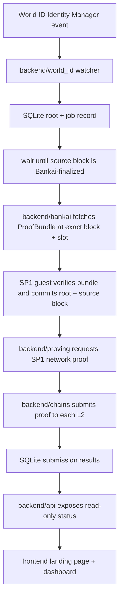
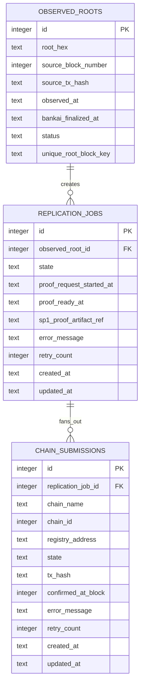

# feat: Master plan for World ID root replicator

## Overview

This document is the master plan for the full World ID root replicator project.
Use it as the parent planning document for scope, architecture, sequencing, and
phase boundaries. For implementation, create or consult narrower phase plans
that inherit from this plan rather than replacing it.

Build a deployable example application that continuously detects new World ID
roots on Ethereum Sepolia, waits until the exact L1 submission block is
finalized in Bankai's finalized view, proves the root with Bankai inside SP1,
and replicates the trusted root to three EVM L2 destinations: Base Sepolia, OP
Sepolia, and Arbitrum Sepolia.

This plan uses the brainstorm in
`docs/brainstorms/2026-03-17-world-id-root-replicator-brainstorm.md` as the
origin document and carries forward all key product and architecture decisions
(see brainstorm:
`docs/brainstorms/2026-03-17-world-id-root-replicator-brainstorm.md`).

The implementation should land as one coherent application, but we should build
it in dependency order and prove one vertical slice before broadening the
surface area. The first successful slice is:

1. detect one new root,
2. record the L1 submission block,
3. wait for Bankai finality for that block,
4. generate one SP1 network proof,
5. submit to one destination chain,
6. expose one read-only API view,
7. render one frontend status page.

## Plan role

This plan is the long-lived architectural source of truth for the whole
project.

- Use this document to understand overall scope, milestones, interface
  boundaries, and risks.
- Do not treat this document as a phase-by-phase task list for immediate
  execution.
- Write and use child phase plans for execution detail, for example the Phase 1
  plan in
  `docs/plans/2026-03-17-002-feat-world-id-root-replicator-phase-1-foundation-plan.md`.
- If a child phase plan and this master plan disagree on project architecture,
  reconcile the conflict here first instead of silently diverging.

## Problem statement

The current repository already contains a good proof-of-concept in
`world-id-root`, but it stops at local example level. It does not persist state,
monitor for new roots, recover from restarts, submit proofs on-chain, or expose
replication status to operators and users.

That gap matters for two reasons:

- The application goal is operational, not educational. It must continue to run
  after deployment.
- The trust model depends on sequencing. The application cannot prove "the
  latest root" in the abstract. It must prove the root at the exact L1 block
  where the new root appeared, and it must wait until that source block is
  available under Bankai's finalized view before generating the proof (see
  brainstorm:
  `docs/brainstorms/2026-03-17-world-id-root-replicator-brainstorm.md`).

## Proposed solution

Create a new top-level example directory named `world-id-root-replicator/` with
four subprojects:

- `backend/` for monitoring, job orchestration, proof submission, SQLite, and
  the read-only API
- `program/` for the SP1 guest that verifies the Bankai proof bundle and emits
  public values
- `contracts/` for the EVM verifier integration and root registry contract
- `frontend/` for the dark-themed landing page and status dashboard

Use `https://github.com/bankaixyz/bankai-sp1-template` as the starting point
for the Rust and SP1 workspace layout instead of bootstrapping the zkVM setup
from scratch. This is the recommended Bankai zkVM path and reduces the chance
of losing time to toolchain, lockfile, patch, or workspace-configuration drift.

The backend is the system coordinator. It listens for root changes on the World
ID Identity Manager, creates an idempotent replication job for each newly
observed root, waits for Bankai finality on the source block, requests a Bankai
proof bundle for the exact storage slot and block, invokes SP1 network proving,
then submits the proof to each configured destination chain. SQLite is the
system of record for job state and per-chain replication state.

The SP1 guest should remain intentionally small. It reads a `ProofBundle`,
calls `verify_batch_proof(...)`, extracts the verified World ID root and source
block number, and commits those as public values.

The contract layer should stay minimal. One contract is enough for v1:
`WorldIdRootRegistry`. It verifies the SP1 proof using the supported SP1
verifier path for the target chain, stores roots keyed by source block number,
tracks `latestRoot` and `latestSourceBlock`, and emits events for successful
updates. The registry constructor must pin both the verifier contract address
and the SP1 program vkey so the destination chain accepts proofs only from the
intended guest program.

The frontend is read-only. It explains the trust flow and renders operational
status from the backend API.

## Technical approach

### Architecture

Use one process for the backend and one SQLite database. Avoid queue brokers,
service splits, and control-plane complexity in v1.

The Rust workspace should be derived from the Bankai SP1 template, then adapted
to include the backend module and the application-specific guest logic. Do not
hand-roll the zkVM workspace or upgrade the template's pinned versions during
initial implementation.

Recommended directory shape:

```text
world-id-root-replicator/
├── Cargo.toml
├── rust-toolchain.toml
├── backend/
│   ├── Cargo.toml
│   ├── migrations/
│   └── src/
│       ├── main.rs
│       ├── config.rs
│       ├── db.rs
│       ├── api/
│       ├── world_id/
│       ├── bankai/
│       ├── proving/
│       ├── chains/
│       └── jobs/
├── program/
│   ├── Cargo.toml
│   └── src/main.rs
├── contracts/
│   ├── foundry.toml
│   ├── src/WorldIdRootRegistry.sol
│   ├── script/
│   └── test/
└── frontend/
    ├── package.json
    ├── app/
    └── components/
```

Core runtime flow:



### Canonical interfaces to lock first

These interfaces should be defined before broad implementation:

- `backend/src/jobs/types.rs`
  `ReplicationJob` state machine and chain submission state
- `program/src/main.rs`
  canonical SP1 public values struct
- `contracts/src/WorldIdRootRegistry.sol`
  `submitRoot(...)` plus immutable verifier and program-vkey binding
- `backend/src/chains/client.rs`
  one trait or function surface for chain submission per configured network

Recommended SP1 public values:

```rust
// world-id-root-replicator/program/src/main.rs
#[derive(Debug, serde::Serialize, serde::Deserialize)]
pub struct PublicValues {
    pub source_block_number: u64,
    pub root: [u8; 32],
}
```

This matches the user requirement and stays aligned with the current example's
minimal guest pattern in
`world-id-root/program/src/main.rs:14` and the typed public-values pattern in
`base-balance/program/src/main.rs:8`.

### Database model

SQLite should track observed roots, replication jobs, and per-chain outcomes.
One normalized schema is enough:



Keep the schema sparse. Do not add generic workflow tables, audit ledgers, or
operator accounts in v1.

### API surface

The backend API should be read-only and intentionally small:

- `GET /api/status`
  service health, current watcher status, current config summary
- `GET /api/roots/latest`
  latest observed root, latest proven root, latest replicated root per chain
- `GET /api/roots`
  recent observed roots and replication state
- `GET /api/chains`
  configured destination chains and latest submission on each
- `GET /api/jobs/:id`
  one replication job with chain submission detail

The frontend should use these APIs only. Do not add action endpoints in v1.

### Contract shape

Use Foundry in `contracts/` for simplicity and good test ergonomics.

The root registry contract should:

- verify the SP1 proof using the supported SP1 verifier path on the target chain
- decode the public values `{source_block_number, root}`
- reject duplicates for the same source block if the root differs
- accept idempotent resubmission if the same root is already stored at the same
  source block
- store `roots[sourceBlockNumber] = root`
- update `latestSourceBlock` and `latestRoot` when the source block is newer
- emit `RootReplicated(uint64 sourceBlockNumber, bytes32 root)`

Important prerequisite:

- confirm canonical SP1 verifier support on Base Sepolia, OP Sepolia, and
  Arbitrum Sepolia before locking implementation
- if any chosen chain lacks the required SP1 verifier path, replace it before
  coding instead of adding custom verifier deployment work in the middle of the
  feature

### Detection and finality strategy

The monitoring logic must be source-block-aware. This is the most important
behavioral requirement in the feature.

Detection flow:

1. Watch the World ID Identity Manager on Ethereum Sepolia for root-changing
   events and read the exact L1 block number where the new root was emitted.
2. Persist the observed root and source block immediately.
3. Poll Bankai's finalized execution height until that exact source block is
   finalized in Bankai's view.
4. Request the Bankai storage-slot proof for that specific block and slot.
5. Generate the SP1 proof from that exact proof bundle.

Do not use "latest finalized height" as a shortcut for the proof request once a
specific root event has already been detected.

### Implementation phases

#### Phase 1: foundation and interface lock

This phase removes ambiguity before deeper implementation begins.

Deliverables:

- [ ] Create `world-id-root-replicator/` workspace with `backend/`, `program/`,
      `contracts/`, and `frontend/`
- [ ] Start from `https://github.com/bankaixyz/bankai-sp1-template` and adapt
      its pinned Rust, SP1, workspace, and lockfile setup for
      `world-id-root-replicator/`
- [ ] Reuse the current local examples only as logic references, especially
      `world-id-root/Cargo.toml:1` and `world-id-root/script/build.rs:1`
- [ ] Define backend config model in
      `world-id-root-replicator/backend/src/config.rs`
- [ ] Add SQLite migrations in
      `world-id-root-replicator/backend/migrations/`
- [ ] Define canonical SP1 `PublicValues` in
      `world-id-root-replicator/program/src/main.rs`
- [ ] Define Solidity contract interface in
      `world-id-root-replicator/contracts/src/WorldIdRootRegistry.sol`
- [ ] Confirm World ID contract address, semantic getter, and storage slot
      derivation for Sepolia
- [ ] Confirm SP1 verifier path support on all three target chains

Success criteria:

- the repo builds with placeholder modules
- the guest public values and contract inputs are frozen
- no unresolved interface ambiguity remains between backend, guest, and
  contract

#### Phase 2: proving pipeline vertical slice

This phase proves the hardest cross-layer dependency with one destination chain
only.

Deliverables:

- [ ] Implement event detection in
      `world-id-root-replicator/backend/src/world_id/watcher.rs`
- [ ] Implement Bankai finality polling in
      `world-id-root-replicator/backend/src/bankai/finality.rs`
- [ ] Implement exact-block proof bundle retrieval in
      `world-id-root-replicator/backend/src/bankai/proof_bundle.rs`
- [ ] Implement SP1 guest in
      `world-id-root-replicator/program/src/main.rs`
- [ ] Implement SP1 network proving client in
      `world-id-root-replicator/backend/src/proving/sp1.rs`
- [ ] Persist job and proof lifecycle state in SQLite
- [ ] Submit to exactly one chain first, preferably Base Sepolia

Success criteria:

- detecting a new root creates exactly one job
- the job waits for Bankai finality on the source block
- the proof bundle is requested for that exact block
- the SP1 network proof succeeds and public values decode correctly
- one destination chain accepts the proof and stores the root

#### Phase 3: multichain fan-out and contract hardening

This phase generalizes the proven slice to all configured chains.

Deliverables:

- [ ] Implement shared submission flow in
      `world-id-root-replicator/backend/src/chains/mod.rs`
- [ ] Add chain configs for Base Sepolia, OP Sepolia, and Arbitrum Sepolia
- [ ] Make per-chain submission idempotent
- [ ] Add Solidity tests for duplicate submissions and out-of-order updates in
      `world-id-root-replicator/contracts/test/WorldIdRootRegistry.t.sol`
- [ ] Add backend retry policy for transient RPC and confirmation failures

Success criteria:

- one completed job fans out to all configured chains
- a failure on one chain does not corrupt or block success on the others
- repeated submission attempts do not double-write or regress state

#### Phase 4: read-only API and frontend

This phase makes the running system observable.

Deliverables:

- [ ] Implement API handlers in
      `world-id-root-replicator/backend/src/api/`
- [ ] Build landing page in
      `world-id-root-replicator/frontend/app/page.tsx`
- [ ] Build dashboard page in
      `world-id-root-replicator/frontend/app/dashboard/page.tsx`
- [ ] Render current root, source block, chain cards, recent jobs, and errors
- [ ] Apply dark theme and responsive layout

Success criteria:

- the frontend is fully read-only
- the landing page explains the trust model clearly
- the dashboard reflects real backend state without operator-only controls

#### Phase 5: deployment and productionization

This phase makes the example runnable after merge.

Deliverables:

- [ ] Add deployment docs in
      `world-id-root-replicator/README.md`
- [ ] Add `.env.example` files for backend and frontend
- [ ] Add structured logging and startup health checks
- [ ] Add restart-safe job rehydration logic from SQLite
- [ ] Add a simple deployment target for backend and frontend

Success criteria:

- a fresh deployment can start from empty state
- a restart resumes unfinished jobs safely
- required environment configuration is documented and minimal

## Alternative approaches considered

### Option 1: separate monitor, prover, and relayer services

This would create cleaner operational boundaries, but it adds queue semantics,
message contracts, and deployment overhead before the feature proves itself.
The brainstorm explicitly rejected this complexity for v1 (see brainstorm:
`docs/brainstorms/2026-03-17-world-id-root-replicator-brainstorm.md`).

### Option 2: script-first implementation

This would be faster to spike, but it would not satisfy the requirement for a
deployable application with durable state, API exposure, and restart recovery.

### Option 3: multi-chain implementation from day one

This sounds efficient, but it risks building three submission paths before the
proof and contract interfaces are stable. The vertical-slice-first plan is
safer.

## System-wide impact

### Interaction graph

The main interaction chain is:

1. World ID contract event triggers the backend watcher.
2. The watcher records an observed root and creates a replication job.
3. The finality poller advances the job once Bankai finalized height covers the
   source block.
4. The Bankai client requests the exact proof bundle for the source block and
   storage slot.
5. The proving client submits the SP1 network proving request.
6. The chain submission client fans the resulting proof out to destination
   chains.
7. The API reads the same SQLite state the worker updates.
8. The frontend reflects the API snapshot.

This means the database schema and job-state model are the central integration
contract for the whole application.

### Error and failure propagation

Expected failure classes:

- source-chain RPC read failures
- Bankai API or Bankai finality lag
- storage-slot derivation mismatch
- SP1 network proving request or proof retrieval failure
- destination-chain RPC failure
- destination transaction revert
- database write conflict or corruption

Handling strategy:

- treat source observation as durable once written to SQLite
- keep proof generation retryable until a terminal validation failure occurs
- isolate per-chain failures so one chain can fail while others continue
- store the latest error string and retry count on both job and
  chain-submission records
- never delete failed records automatically

### State lifecycle risks

The main risk is partial progress across layers:

- observed root written, but no job created
- job created, but proof artifact reference missing
- proof created, but chain submission rows missing
- two workers attempt the same chain submission concurrently

Mitigations:

- wrap related writes in narrow transactions
- use unique keys on `(root, source_block_number)` and
  `(replication_job_id, chain_name)`
- use explicit state transitions rather than inferred state
- make on-chain submission idempotent at both the DB and contract layers

### API surface parity

Equivalent surfaces that must stay aligned:

- SP1 public values struct in `program/src/main.rs`
- Solidity decode and storage logic in `contracts/src/WorldIdRootRegistry.sol`
- Rust decode and submit logic in `backend/src/chains/`
- JSON API response types in `backend/src/api/`

If any of these change, the others must change together.

### Integration test scenarios

These scenarios matter more than isolated unit tests:

1. detect a new root, wait for Bankai finality, and submit successfully to one
   destination chain
2. detect a root whose source block is not yet Bankai-finalized and verify that
   proving does not start early
3. generate one proof and submit successfully to two chains while a third chain
   fails and retries independently
4. restart the backend after proof generation but before all chain submissions
   finish and verify that work resumes cleanly
5. receive duplicate event observations for the same root and source block and
   verify that only one logical job persists

## SpecFlow analysis

The flow analysis for this feature surfaces these planning-critical edges:

- first detection versus replay on restart
- Bankai lag relative to source-chain observation
- duplicate root observations for the same source block
- multiple roots appearing in close succession
- per-chain partial failure after proof generation
- frontend behavior when the backend is healthy but one chain is stale

This plan resolves those gaps by:

- making SQLite the durable source of truth
- defining `waiting_finality` against Bankai's finalized view
- requiring idempotent job and submission keys
- keeping the frontend read-only and status-driven

## Acceptance criteria

### Functional requirements

- [ ] A deployed backend can observe new World ID roots on Ethereum Sepolia.
- [ ] Each observed root records the exact L1 source block number and tx hash.
- [ ] The backend waits until Bankai finalized height covers that exact source
      block before requesting a proof bundle.
- [ ] The Bankai request uses the Sepolia Identity Manager and the re-derived
      storage slot for `_latestRoot`.
- [ ] The SP1 guest verifies the Bankai proof bundle and commits
      `{source_block_number, root}` as public values.
- [ ] The backend uses SP1 network proving for production proof generation.
- [ ] The backend submits each completed proof to Base Sepolia, OP Sepolia, and
      Arbitrum Sepolia.
- [ ] The root registry contract stores roots by source block and tracks latest
      root and latest source block.
- [ ] The backend exposes read-only API endpoints for status, roots, jobs, and
      chains.
- [ ] The frontend renders a dark-themed landing page and dashboard from the
      backend API.

### Non-functional requirements

- [ ] All critical workflow state persists in SQLite.
- [ ] The backend can restart without losing in-flight job state.
- [ ] Duplicate root observations do not create duplicate logical work.
- [ ] Chain submission failures are isolated per chain.
- [ ] The system logs enough structured context to debug one failed job.

### Quality gates

- [ ] Rust workspace builds cleanly.
- [ ] Contract tests cover duplicate and out-of-order submission behavior.
- [ ] Backend integration tests cover exact-block finality waiting and restart
      recovery.
- [ ] Frontend pages render correctly on desktop and mobile.
- [ ] The README documents local setup and deployed operation.

## Success metrics

The feature is successful when:

- a newly observed Sepolia World ID root becomes visible in the frontend with a
  full job history
- the corresponding root is written successfully on all three target chains
- the system survives a backend restart without duplicating work
- an operator can identify stale or failed replication from the dashboard in
  under one minute

## Dependencies and prerequisites

- Bankai SDK and verifier path consistent with the current example setup in
  `world-id-root/Cargo.toml:1`, but initialized from the Bankai SP1 template
  rather than assembled manually
- SP1 v5 pinned toolchain and prover-network credentials
- World ID Sepolia Identity Manager address and verified storage slot
- destination-chain RPC URLs and funded submitter key
- confirmed SP1 verifier support on Base Sepolia, OP Sepolia, and Arbitrum
  Sepolia
- a deployment target for backend and frontend

## Risk analysis and mitigation

### Risk: storage slot drift after World ID upgrade

Mitigation:

- verify the slot derivation during implementation against `latestRoot()`
- add a startup assertion path in the backend

### Risk: Bankai finality misunderstanding leads to premature proofs

Mitigation:

- treat the source block as a first-class field in the schema
- block proof generation until Bankai finalized height covers that source block
- add an integration test specifically for this behavior

### Risk: SP1 verifier availability differs by chain

Mitigation:

- verify support before implementation begins
- replace unsupported chains early rather than mid-build

### Risk: multichain fan-out creates partial success confusion

Mitigation:

- model per-chain submission state explicitly
- reflect per-chain success and failure in the API and frontend

### Risk: local development becomes too heavy

Mitigation:

- keep local execute mode for debugging
- reserve network proving for production and real integration testing

## Resource requirements

- Rust for backend and guest development
- Solidity and Foundry for contract work
- React and Next.js for the frontend
- one funded deployer/submission key per target testnet environment
- one SP1 prover-network credential set

## Future considerations

- mainnet support after the Sepolia pipeline is stable
- additional destination chains
- replay controls or operator-triggered resubmission
- historical backfill of older roots
- non-EVM destination verification targets

## Documentation plan

Update or create these docs as part of the implementation:

- `world-id-root-replicator/README.md`
  architecture, local setup, deploy flow, and environment variables
- repository `README.md`
  add the new example entry after implementation
- frontend inline copy
  explain Bankai-finalized source blocks clearly

## Sources and references

### Origin

- Brainstorm document:
  `docs/brainstorms/2026-03-17-world-id-root-replicator-brainstorm.md`
  Key decisions carried forward: single-app architecture, Bankai-finality-based
  proving, Sepolia-only source scope, three read-only destination-chain status
  views, and SP1 network proving by default.

### Internal references

- Existing Bankai proof collection flow:
  `world-id-root/script/src/bin/main.rs:51`
- Existing world-id guest verification flow:
  `world-id-root/program/src/main.rs:14`
- Existing typed public-values pattern:
  `base-balance/program/src/main.rs:8`
- Recommended zkVM starting point:
  `https://github.com/bankaixyz/bankai-sp1-template`
- Origin brainstorm decisions:
  `docs/brainstorms/2026-03-17-world-id-root-replicator-brainstorm.md:14`

### External references

- Bankai SDK docs:
  `https://docs.bankai.xyz/llms-sdk.txt`
- SP1 prover network quickstart:
  `https://docs.succinct.xyz/docs/next/sp1/prover-network/quickstart`
- World address book:
  `https://docs.world.org/reference/address-book`
- World contracts reference:
  `https://docs.world.org/world-id/reference/contracts`
- Sepolia Identity Manager proxy:
  `https://sepolia.etherscan.io/address/0xb2EaD588f14e69266d1b87936b75325181377076#code`
- Sepolia Identity Manager implementation:
  `https://sepolia.etherscan.io/address/0x388516729878cb04463e5aee8bf12279bc004d3f#code`
