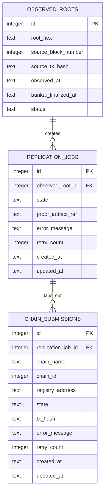

# feat: Phase 1 foundation for World ID root replicator

## Overview

This plan narrows the master application plan to Phase 1 only. The goal of this
phase is to create a stable foundation for the World ID root replicator so that
later implementation can proceed without reworking toolchain setup, workspace
structure, proof interfaces, or database contracts.

Phase 1 does not try to deliver a running end-to-end replicator. It locks the
project skeleton, the Bankai and SP1 setup path, the SQLite schema, the core
state types, the SP1 public output shape, and the Solidity contract interface.
When this phase is complete, the rest of the project can build on fixed
interfaces instead of shifting assumptions.

This plan carries forward the key decisions from the brainstorm and the master
plan, especially these constraints:

- use the Bankai SP1 template as the zkVM starting point
- keep the system as one application with one SQLite database
- treat Bankai finality of the exact source block as a first-class concept
- use SP1 network proving as the production path
- keep the frontend read-only

See brainstorm:
`docs/brainstorms/2026-03-17-world-id-root-replicator-brainstorm.md`.
See master plan:
`docs/plans/2026-03-17-001-feat-world-id-root-replicator-plan.md`.

## Problem statement

The largest early risk in this project is not business logic. It is foundation
drift. If we start implementation before freezing the template setup, workspace
layout, schema, contract boundary, and SP1 public values, Phase 2 and Phase 3
will end up discovering mismatches that force rework.

We already have two useful local examples in this repo, `world-id-root` and
`base-balance`, but they are reference points for proof logic, not the
authoritative setup path. The current Bankai guidance for zkVM projects says to
start from `bankai-sp1-template`, preserve its lockfile and pinned versions,
and customize the host and guest logic only after setup is confirmed. Phase 1
must encode that rule clearly so the implementation does not accidentally mix
template conventions and local-example conventions in incompatible ways.

## Proposed solution

Create a new `world-id-root-replicator/` example directory and use the Bankai
SP1 template as the base for the Rust and SP1 workspace. Adapt that template to
the application shape decided in the master plan:

- `backend/` replaces the template's generic host role and owns orchestration,
  persistence, API, and future proving/submission logic
- `program/` stays the SP1 guest crate
- `contracts/` holds the root registry contract and tests
- `frontend/` is scaffolded only enough to reserve structure for later phases

At the end of Phase 1, the repository should contain a buildable workspace with
placeholder modules, a first SQLite migration, strongly typed core state
definitions, a typed SP1 public-values struct, and a Solidity contract
interface that matches those public values.

## Technical approach

### Scope of this phase

This phase is intentionally narrow. It covers setup and interface lock only.
Everything here exists to make later coding safer and simpler.

Phase 1 includes:

- workspace and toolchain setup
- template adaptation rules
- crate and directory creation
- config model
- SQLite migration and DB access shell
- core job and chain state types
- SP1 public-values definition
- contract interface definition
- root source and storage-slot verification plan

Phase 1 excludes:

- event watching
- Bankai finality polling
- proof-bundle retrieval
- SP1 proof generation
- on-chain submission
- frontend data rendering
- deployment automation

### Research findings that shape this phase

Local repo context is strong enough that we do not need broad framework
research, but targeted Bankai research is valuable because zkVM setup is
version-sensitive.

Relevant findings:

- The brainstorm already fixed the high-level architecture, source chain,
  destination chains, read-only UI, and Bankai finality requirement. See
  `docs/brainstorms/2026-03-17-world-id-root-replicator-brainstorm.md:14`.
- The master plan already fixed the long-term directory shape and Phase 1 goal.
  See `docs/plans/2026-03-17-001-feat-world-id-root-replicator-plan.md:55` and
  `docs/plans/2026-03-17-001-feat-world-id-root-replicator-plan.md:292`.
- The existing `world-id-root` example shows the current proof-logic reference
  flow, including `Bankai::new(...)`, `BankaiBlockFilterDto::finalized()`,
  `init_batch(None, HashingFunction::Keccak)`, and
  `ethereum_storage_slot(...)`. See `world-id-root/script/src/bin/main.rs:51`.
- The existing `world-id-root` guest shows the minimal `ProofBundle` verification
  path. See `world-id-root/program/src/main.rs:14`.
- The existing `base-balance` guest shows the right pattern for typed public
  values. See `base-balance/program/src/main.rs:8`.
- The current live Bankai SDK docs say the fastest zkVM path is to clone
  `bankai-sp1-template`, keep its pinned versions and lockfile, and customize
  from there.

There are no `docs/solutions/` learnings in this repository yet, so this phase
should document decisions clearly enough to become that future local context.

### Template precedence rules

Phase 1 must establish a clear precedence order so later implementation does
not mix incompatible setup sources.

Authoritative setup order:

1. `bankai-sp1-template` is authoritative for zkVM workspace structure,
   lockfile, toolchain, version pins, and SP1 build conventions.
2. The local `world-id-root` and `base-balance` examples are authoritative only
   for application logic patterns that we want to adapt.
3. If the template and the local examples disagree on pinned versions, lockfile
   contents, or workspace wiring, prefer the template during initial setup.
4. Do not upgrade template-pinned dependencies during Phase 1 unless we
   explicitly decide to align this example with the repo's existing Bankai
   examples. For this phase, we keep the Bankai crates on `v0.1.2.3` by
   explicit user direction and document that exception clearly.

This is the most important non-code decision in the phase.

### Workspace structure to create

Create this application skeleton in `world-id-root-replicator/`:

```text
world-id-root-replicator/
├── Cargo.toml
├── Cargo.lock
├── rust-toolchain.toml
├── .env.example
├── backend/
│   ├── Cargo.toml
│   ├── build.rs
│   ├── migrations/
│   │   └── 0001_initial_schema.sql
│   └── src/
│       ├── main.rs
│       ├── config.rs
│       ├── db.rs
│       ├── lib.rs
│       ├── api/mod.rs
│       ├── bankai/mod.rs
│       ├── chains/mod.rs
│       ├── jobs/mod.rs
│       ├── jobs/types.rs
│       ├── world_id/mod.rs
│       └── proving/mod.rs
├── program/
│   ├── Cargo.toml
│   └── src/main.rs
├── contracts/
│   ├── foundry.toml
│   ├── src/WorldIdRootRegistry.sol
│   ├── test/WorldIdRootRegistry.t.sol
│   └── README.md
└── frontend/
    ├── package.json
    ├── app/page.tsx
    ├── app/dashboard/page.tsx
    └── README.md
```

Phase 1 does not need all files to contain full logic, but the structure must
exist and compile or lint at the level appropriate for each language.

### Interface decisions to freeze

Phase 1 exists largely to freeze interfaces. These decisions must be explicit
in the code and in the documentation by the end of the phase.

#### SP1 public values

Use a typed struct rather than `commit_slice(...)` directly. This follows the
cleaner pattern from `base-balance` and gives Solidity and Rust a clearer shared
contract.

Recommended shape:

```rust
// world-id-root-replicator/program/src/main.rs
#[derive(Debug, serde::Serialize, serde::Deserialize)]
pub struct PublicValues {
    pub source_block_number: u64,
    pub root: [u8; 32],
}
```

This shape is fixed in Phase 1. Do not add destination-chain-specific or
proof-metadata fields yet.

#### Backend job types

Create `world-id-root-replicator/backend/src/jobs/types.rs` and define the
smallest useful state types:

- `ObservedRoot`
- `ReplicationJobState`
- `ChainSubmissionState`
- `DestinationChain`

Recommended `ReplicationJobState` values for Phase 1:

- `Detected`
- `WaitingFinality`
- `ReadyToProve`
- `ProofInProgress`
- `ProofReady`
- `Submitting`
- `Completed`
- `Failed`

Phase 1 does not implement transitions, but it must define them.

#### Contract interface

Create `world-id-root-replicator/contracts/src/WorldIdRootRegistry.sol` and
freeze the external write surface for later phases.

Minimum interface to define:

- storage for `latestRoot`
- storage for `latestSourceBlock`
- mapping from `sourceBlockNumber` to `root`
- event `RootReplicated(uint64 sourceBlockNumber, bytes32 root)`
- external method shape for proof submission and decoding

Phase 1 does not need a final verifier implementation wired up, but it must
lock the public method signature and storage layout assumptions that the backend
and guest will target.

### SQLite schema to create

Create `world-id-root-replicator/backend/migrations/0001_initial_schema.sql`
with the initial schema for the three core tables below.



Required constraints:

- unique key on `(root_hex, source_block_number)` in `observed_roots`
- unique key on `(replication_job_id, chain_name)` in `chain_submissions`
- foreign keys enabled

Phase 1 should also add a small `db.rs` wrapper that owns DB startup and
migration application, but not repository-layer abstraction yet.

### Root source verification work

Phase 1 must explicitly verify the World ID root source assumptions before any
proof pipeline logic begins.

Required checks:

1. confirm the Sepolia Identity Manager proxy address still matches the address
   already documented in the brainstorm and local example
2. confirm the semantic source field is `_latestRoot`, exposed by
   `latestRoot()`
3. re-derive the storage slot rather than blindly inheriting `0x12e`
4. record the derivation result in a short note or code comment near the final
   constant definition

This is a Phase 1 deliverable because it directly affects later proof-bundle
requests.

### Bankai and SP1 setup decisions

Use the Bankai-recommended zkVM path:

- clone or copy from `bankai-sp1-template`
- preserve template lockfile and pinned versions
- preserve `resolver = "3"` and the required `ethereum_hashing` patch
- adapt the host-side crate into `backend/` only after confirming the template
  builds as-is

Use the local examples as logic references only:

- `world-id-root/Cargo.toml:1`
- `world-id-root/program/src/main.rs:14`
- `world-id-root/script/src/bin/main.rs:51`
- `base-balance/program/src/main.rs:8`

If the template ships different Bankai crate tags than the local examples,
prefer the template by default. For this Phase 1 execution, we made one
explicit exception and kept the Bankai crates on `v0.1.2.3` so the new example
stays aligned with the repo's existing Bankai examples. That decision must stay
documented in the README and the plan so later agents do not silently revert
it.

## Implementation phases

### Step 1: Import and validate the template

This step proves the base setup before any application-specific edits spread
through the repo.

Deliverables:

- [x] import the `bankai-sp1-template` baseline into a temporary or working
      scaffold under `world-id-root-replicator/`
- [x] verify the template builds before structural edits
- [x] preserve `Cargo.lock`, `rust-toolchain.toml`, and document the explicit
      Bankai crate tag decision
- [x] note any differences between the template pins and the local examples

Acceptance checks:

- [x] the imported baseline builds successfully
- [x] no dependency upgrades are introduced beyond the documented Bankai crate
      alignment to `v0.1.2.3`
- [x] the initial scaffold documents template provenance

### Step 2: Reshape the workspace to the application layout

This step adapts the template from generic example form to the application
layout chosen in the master plan.

Deliverables:

- [x] create `backend/` as the long-lived host crate
- [x] preserve the SP1 build path in `backend/build.rs`
- [x] keep `program/` as the guest crate
- [x] add empty `contracts/` and `frontend/` directories with minimal
      manifests or README placeholders
- [x] update the root workspace manifest so the intended members are explicit

Acceptance checks:

- [x] the Rust workspace still builds after the reshape
- [x] the workspace no longer depends on an ambiguous future rename from
      `script/` to `backend/`
- [x] every top-level subproject named in the master plan exists

### Step 3: Define backend config and database startup

This step creates the application shell that later worker logic will sit inside.

Deliverables:

- [x] create `backend/src/config.rs`
- [x] create `backend/src/db.rs`
- [x] create `backend/.env.example` or root `.env.example` entries for required
      runtime configuration
- [x] wire basic startup in `backend/src/main.rs`
- [x] add SQLx SQLite migration support

Initial config keys to define:

- `DATABASE_URL`
- `EXECUTION_RPC`
- `BEACON_RPC` if required by final proof path
- `BANKAI_NETWORK`
- `BANKAI_API_BASE_URL` only if custom override is needed
- `NETWORK_PRIVATE_KEY`
- one RPC and one registry address entry per target chain

Acceptance checks:

- [x] backend starts and applies migrations against SQLite
- [x] config loading fails loudly on missing required values
- [x] there is one documented source of truth for environment variables

### Step 4: Define core domain types and migration

This step freezes the internal data model.

Deliverables:

- [x] write `backend/migrations/0001_initial_schema.sql`
- [x] define `ObservedRoot`, `ReplicationJobState`, `ChainSubmissionState`, and
      `DestinationChain` in `backend/src/jobs/types.rs`
- [x] add any minimal shared types in `backend/src/lib.rs` or a small shared
      module

Acceptance checks:

- [x] the migration applies cleanly on a fresh database
- [x] the schema expresses the uniqueness constraints we need for idempotency
- [x] the Rust state types align with the persisted state names

### Step 5: Freeze SP1 public values and guest skeleton

This step prevents later cross-language drift.

Deliverables:

- [x] define `PublicValues` in `program/src/main.rs`
- [x] replace `commit_slice(...)` style output with typed `commit(...)`
- [x] leave the guest logic as a small placeholder or near-placeholder that
      clearly targets `ProofBundle -> verify_batch_proof(...) -> PublicValues`

Acceptance checks:

- [x] the guest crate builds
- [x] public values are serializable and stable
- [x] the backend and contract plan both reference the same fields and names

### Step 6: Freeze the Solidity registry contract surface

This step locks the destination-side interface that later backend submission
code will call.

Deliverables:

- [x] create `contracts/src/WorldIdRootRegistry.sol`
- [x] create `contracts/test/WorldIdRootRegistry.t.sol`
- [x] define storage layout, event, and submission method signature
- [x] add placeholder or minimal tests for storage invariants

Acceptance checks:

- [x] Foundry compiles the contract scaffold
- [x] the contract surface matches the `PublicValues` definition
- [x] there is no unresolved ambiguity about source block and root storage

### Step 7: Verify the World ID root source assumptions

This step turns the current slot constant from a guess into a verified project
input.

Deliverables:

- [x] confirm Sepolia proxy address and implementation reference
- [x] confirm `_latestRoot` and `latestRoot()` remain the semantic source
- [x] re-derive the storage slot and document the result
- [x] place the final constant where later backend or proof code can use it

Acceptance checks:

- [x] the project no longer relies on an undocumented inherited slot constant
- [x] the slot source is documented in code or repo docs

## SpecFlow analysis

Phase 1 is not user-facing, but it still has important flow gaps to close.

### User flow overview

The effective "user" in this phase is the future implementer of Phase 2 and
beyond. Their flow is:

1. open the new example directory
2. understand the workspace structure immediately
3. run the workspace without dependency drift
4. see stable interfaces for DB, guest output, and contract input
5. continue Phase 2 without revisiting setup decisions

### Missing elements and gaps this phase must resolve

- **Setup ownership**: If we do not fix template precedence now, later work can
  drift between template and local-example versions.
- **Host crate identity**: If we do not decide how `backend/` relates to the
  template host crate now, Phase 2 will code against a temporary structure.
- **Public-values contract**: If we leave the SP1 output vague, Solidity and
  backend code will diverge.
- **Storage-slot provenance**: If we do not verify the slot now, later proofs
  may appear to work while targeting the wrong state.
- **Schema idempotency**: If we defer uniqueness constraints, later worker code
  will need painful migration changes.

### Critical questions resolved by this plan

1. Which setup path wins if the template and local examples differ?
   Assumption if unanswered: people will mix both, which is risky.
   Resolution: the template wins for setup, with one explicit Phase 1 exception
   for the Bankai crate tag so this example stays on `v0.1.2.3`.

2. Is Phase 1 allowed to implement watchers or proving logic?
   Assumption if unanswered: scope will sprawl.
   Resolution: no, those are explicitly out of scope.

3. What exact interfaces must be frozen before Phase 2?
   Assumption if unanswered: later phases will redefine them mid-stream.
   Resolution: DB schema, job states, `PublicValues`, contract interface, and
   root-source constants.

## Acceptance criteria

### Functional requirements

- [x] `world-id-root-replicator/` exists with the planned top-level structure.
- [x] the Rust and SP1 workspace is derived from `bankai-sp1-template`.
- [x] the project preserves the template lockfile and toolchain, with a
      documented Bankai crate tag override to `v0.1.2.3`.
- [x] `backend/` exists as the intended host/runtime crate.
- [x] the first SQLite migration exists and applies successfully.
- [x] the core job and chain state types are defined in Rust.
- [x] the SP1 public-values struct is defined and fixed.
- [x] the Solidity contract surface is defined and compiles.
- [x] the World ID Sepolia root source and storage slot are verified and
      documented.

### Non-functional requirements

- [x] setup precedence between template and local examples is documented
      clearly.
- [x] the phase leaves no unresolved interface ambiguity for Phase 2.
- [x] the new documentation points future implementers to the correct starting
      files.

### Quality gates

- [x] Rust workspace builds after the restructure.
- [x] SQLx migration applies on a fresh SQLite database.
- [x] Foundry compiles the Phase 1 contract scaffold.
- [x] documentation reflects the actual workspace layout.

## Success metrics

Phase 1 is successful when a future implementer can clone the repo, open
`world-id-root-replicator/`, and answer these questions without guessing:

- where does the backend live?
- what exact data will the SP1 guest emit?
- what exact data will the contract accept and store?
- what database tables exist already?
- which toolchain and dependency pins are authoritative?
- which World ID contract field and storage slot are we proving?

## Dependencies and prerequisites

- the current brainstorm:
  `docs/brainstorms/2026-03-17-world-id-root-replicator-brainstorm.md`
- the current master plan:
  `docs/plans/2026-03-17-001-feat-world-id-root-replicator-plan.md`
- the local reference examples:
  `world-id-root/` and `base-balance/`
- the Bankai SDK live docs:
  `https://docs.bankai.xyz/llms-sdk.txt`
- the Bankai SP1 template:
  `https://github.com/bankaixyz/bankai-sp1-template`

## Risk analysis and mitigation

### Risk: workspace drift between template and local examples

Mitigation:

- document template precedence explicitly
- preserve template pins by default and document any approved exception

### Risk: hidden rename cost from `script` to `backend`

Mitigation:

- make the host-crate decision in Phase 1
- adapt the workspace layout now instead of carrying a temporary crate name

### Risk: output contract drift between Rust and Solidity

Mitigation:

- define typed `PublicValues` now
- define the Solidity submission interface in the same phase

### Risk: schema churn after worker logic starts

Mitigation:

- add the first real migration now
- include uniqueness constraints from the beginning

### Risk: incorrect root source assumption

Mitigation:

- verify the contract field and slot in Phase 1
- document provenance near the constant definition

## Documentation plan

Phase 1 should create or update these docs:

- `docs/plans/2026-03-17-002-feat-world-id-root-replicator-phase-1-foundation-plan.md`
- `world-id-root-replicator/README.md` with setup notes and template provenance
- `contracts/README.md` with Phase 1 contract assumptions if useful

## Sources and references

### Origin

- Brainstorm document:
  `docs/brainstorms/2026-03-17-world-id-root-replicator-brainstorm.md`
  Key decisions carried forward: single-app structure, Bankai-finality-based
  sequencing, Sepolia source scope, SP1 network proving, and the `_latestRoot`
  semantic source.

### Internal references

- Master plan:
  `docs/plans/2026-03-17-001-feat-world-id-root-replicator-plan.md:55`
- Local workspace pin reference:
  `world-id-root/Cargo.toml:1`
- Local guest verification reference:
  `world-id-root/program/src/main.rs:14`
- Local proof host reference:
  `world-id-root/script/src/bin/main.rs:51`
- Local typed public-values reference:
  `base-balance/program/src/main.rs:8`

### External references

- Bankai SDK docs:
  `https://docs.bankai.xyz/llms-sdk.txt`
- Bankai recommended SDK path notes:
  `/Users/paul/.codex/skills/bankai-sdk/references/sdk-recommended-paths.md`
- Bankai SP1 template:
  `https://github.com/bankaixyz/bankai-sp1-template`

## Next steps

Phase 1 is complete. The best follow-up is to create the detailed Phase 2 plan
for the first end-to-end proving slice, using this completed foundation as the
fixed interface baseline. The main checkpoint from this phase is not feature
completeness. It is interface confidence.
