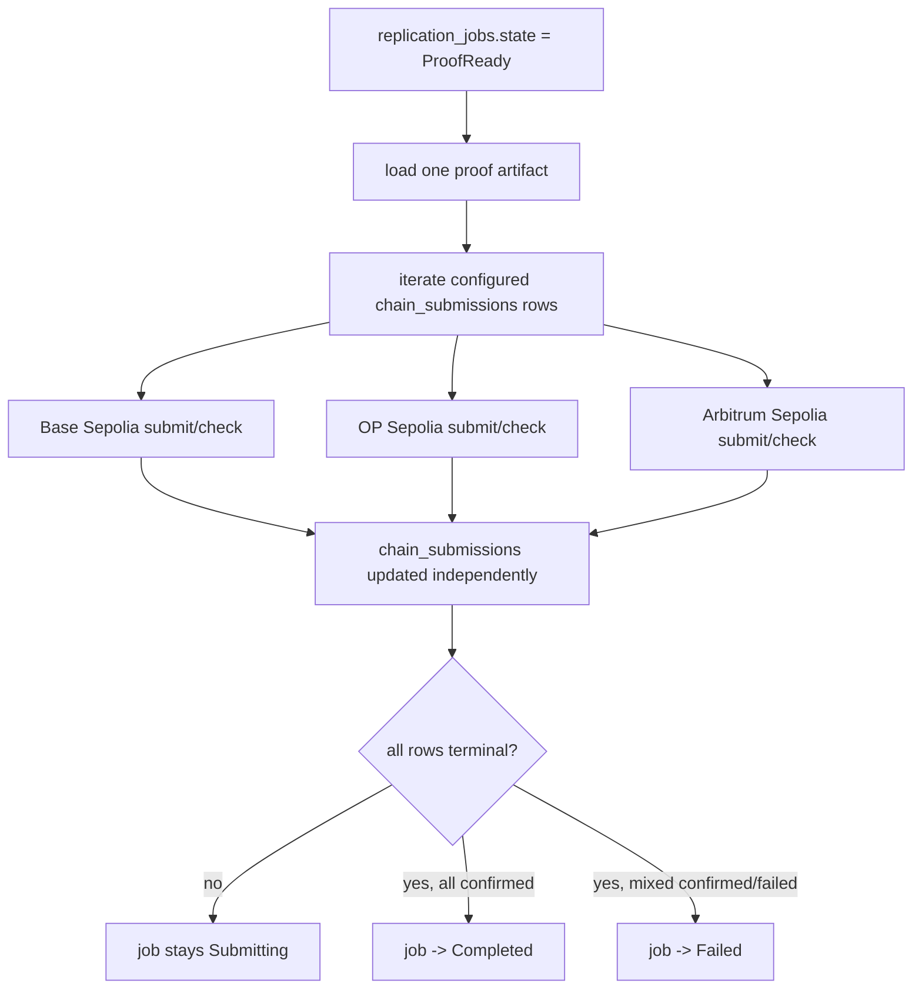

# feat: Phase 3 multichain fan-out and contract hardening for World ID root replicator

## Overview

This plan narrows the master plan to Phase 3 only. The goal is to take the
completed Phase 2 proving slice and generalize it from one destination chain to
the full version-one target set: Base Sepolia, OP Sepolia, and Arbitrum
Sepolia.

Phase 3 must preserve the core decisions from the brainstorm and master plan:

- keep the system as one Rust application with one SQLite database
- prove a detected root exactly once per source block
- treat destination chains as config, not code branches
- keep the backend simple and sequential unless concurrency is strictly needed
- preserve source-block-aware Bankai finality and exact-block proof requests

See brainstorm:
`docs/brainstorms/2026-03-17-world-id-root-replicator-brainstorm.md`
See master plan:
`docs/plans/2026-03-17-001-feat-world-id-root-replicator-plan.md`
See Phase 1:
`docs/plans/2026-03-17-002-feat-world-id-root-replicator-phase-1-foundation-plan.md`
See Phase 2:
`docs/plans/2026-03-17-003-feat-world-id-root-replicator-phase-2-proving-slice-plan.md`

## Problem statement

Phase 2 proved the hardest vertical slice, but it is still architecturally
single-chain. The current implementation can detect a World ID root, wait for
Bankai finality, build one proof, and submit that proof to Base Sepolia only.

That leaves the main version-one product requirement incomplete. The brainstorm
explicitly decided that v1 targets three EVM L2 destinations and that the
backend should treat those destinations as configuration, not as separate
bespoke flows (see brainstorm:
`docs/brainstorms/2026-03-17-world-id-root-replicator-brainstorm.md`).

The risk in this phase is not proving anymore. The risk is state management:

- one proof must fan out safely to multiple chains
- a failure on one chain must not erase or block progress on the others
- restart behavior must remain safe when some chains are confirmed and others
  are still pending
- duplicate submits must stay idempotent at both the backend and contract
  layers

## Scope of this phase

Phase 3 includes:

- multichain destination config for Base Sepolia, OP Sepolia, and Arbitrum
  Sepolia
- shared EVM submission flow for all configured chains
- SQLite-backed fan-out from one proof artifact to multiple chain submission
  rows
- aggregate job completion and failure rules across per-chain outcomes
- backend retry policy for transient send and confirmation failures
- contract-test hardening for duplicate, conflicting, and out-of-order updates

Phase 3 excludes:

- frontend work
- read-only API expansion beyond what the worker needs internally
- deployment automation beyond the minimum env and runtime wiring needed to run
  the backend locally
- queue brokers, separate relayers, or multi-process workers
- new operator controls or replay tools
- non-EVM destinations

## Current implementation status

The current codebase already contains the right raw ingredients for multichain
support, but the runtime still assumes one destination:

- `world-id-root-replicator/backend/src/config.rs:8` defines one
  `base_sepolia` destination on `Config`, not a list of destinations.
- `world-id-root-replicator/backend/src/chains/mod.rs:1` only exposes
  `base_sepolia`.
- `world-id-root-replicator/backend/src/jobs/runner.rs:19` stores exactly one
  `chain_name`, one destination config, one registry address, and one
  submission client on the runner.
- `world-id-root-replicator/backend/src/jobs/runner.rs:32` builds that runner
  from `config.base_sepolia` only.
- `world-id-root-replicator/backend/src/db.rs:117` already inserts a
  `chain_submissions` row when a new root is recorded, but it does so for one
  destination only.
- `world-id-root-replicator/backend/src/db.rs:281` selects the next active job
  by one `chain_name`, which hard-codes single-destination execution.
- `world-id-root-replicator/backend/migrations/0001_initial_schema.sql:24`
  already has a normalized `chain_submissions` table with
  `UNIQUE(replication_job_id, chain_name)`, which is a good base for fan-out.
- `world-id-root-replicator/contracts/test/WorldIdRootRegistry.t.sol:35`
  already covers same-value idempotency and
  `world-id-root-replicator/contracts/test/WorldIdRootRegistry.t.sol:77`
  already covers conflicting roots for the same source block.

This means Phase 3 should be a hard cutover from "single chain with multichain
schema hints" to "real multichain fan-out," not a second proofing phase.

## Research findings that shape this phase

### Brainstorm decisions carried forward

- The backend stays one process with one SQLite database, not a service mesh or
  queue system (see brainstorm:
  `docs/brainstorms/2026-03-17-world-id-root-replicator-brainstorm.md:31`).
- Destination chains are configuration, not code branches, and version one
  targets exactly Base Sepolia, OP Sepolia, and Arbitrum Sepolia (see
  brainstorm:
  `docs/brainstorms/2026-03-17-world-id-root-replicator-brainstorm.md:70`).
- Reliability and clarity matter more than throughput for v1, so we should
  favor a simple and restart-safe fan-out model over parallel complexity (see
  brainstorm:
  `docs/brainstorms/2026-03-17-world-id-root-replicator-brainstorm.md:25`).

### Master-plan decisions carried forward

- Phase 3 is explicitly defined as "multichain fan-out and contract hardening"
  and must implement shared submission flow, three chain configs, per-chain
  idempotency, stronger contract tests, and retry policy for transient RPC and
  confirmation failures (see master plan:
  `docs/plans/2026-03-17-001-feat-world-id-root-replicator-plan.md:378`).
- Phase 3 success requires that one completed proof fans out to all configured
  chains and that failures stay isolated per chain (see master plan:
  `docs/plans/2026-03-17-001-feat-world-id-root-replicator-plan.md:392`).

### Local code findings

- The current runner is intentionally single-destination, so Phase 3 must
  generalize `Runner` rather than bolt on more one-off submission paths (see
  `world-id-root-replicator/backend/src/jobs/runner.rs:19`).
- The current schema is already close to sufficient. We should reuse
  `chain_submissions` rather than adding more workflow tables (see
  `world-id-root-replicator/backend/migrations/0001_initial_schema.sql:24`).
- The current contract interface `submitRoot(bytes,bytes)` is already generic
  enough for all three chains, so contract hardening should focus mostly on
  behavior and tests, not on changing the Solidity surface (see
  `world-id-root-replicator/contracts/src/WorldIdRootRegistry.sol:35`).
- The local contract README already documents SP1 verifier support for Sepolia,
  Base Sepolia, OP Sepolia, and Arbitrum Sepolia in the current workspace docs
  (see `world-id-root-replicator/contracts/README.md:20`).

### Institutional learnings

There is no `docs/solutions/` directory in this repository yet, so there are no
prior institutional learnings to inherit for this phase.

## Research decision

Local context is strong enough that external research is not necessary for the
planning pass.

Why that is reasonable:

- the brainstorm already fixed the destination-chain set and architecture
- the master plan already fixed the phase boundary and deliverables
- the current code clearly shows the single-chain assumptions that Phase 3 must
  remove
- the local contract docs already note verifier support on the target chains

Implementation should still re-validate live verifier addresses and deployed
registry env values immediately before coding or running against testnets, but
that is a coding-time verification task, not a planning blocker.

## Proposed solution

Keep the proof pipeline job-level and make submission chain-level.

That means:

1. detecting a new root still creates one `observed_roots` row
2. that root still creates one `replication_jobs` row
3. the job still waits for Bankai finality and still generates exactly one SP1
   proof artifact
4. once the proof is ready, the backend advances one `chain_submissions` row
   per configured destination chain
5. each chain submission tracks its own state, tx hash, retries, and failure
   message
6. the top-level job state becomes an aggregate summary over chain-submission
   states once proof generation has finished

This keeps the architecture simple:

- no second proof job per chain
- no queue broker
- no separate relayer service
- no chain-specific proof format branches

### Intentional design choices

#### Use one shared EVM submitter path

All three target chains use the same contract interface and the same proof
artifact shape, so the backend should use one shared EVM submitter
implementation parameterized by `DestinationChainConfig`.

Do not create three near-identical submission modules unless a real chain-level
difference forces that later.

#### Keep execution sequential in v1

The simplest correct fan-out model is:

- one runner loop
- one proof artifact
- advance one or more chain-submission states per loop
- derive aggregate job completion after checking all chain rows

Do not add Tokio task fan-out or concurrent sends in this phase unless the
simple sequential model proves insufficient. Reliability is more important than
maximum throughput here (see brainstorm:
`docs/brainstorms/2026-03-17-world-id-root-replicator-brainstorm.md`).

#### Keep aggregate job state simple

We do not need a new job-state enum variant just to model partial success.

Recommended aggregate rule:

- if any chain submission is still `pending` or `submitting`, keep the job in
  `Submitting`
- if every chain submission is `confirmed`, mark the job `Completed`
- if every chain submission is terminal and at least one is `failed`, mark the
  job `Failed`

This preserves a small state model while keeping the per-chain rows as the real
source of truth for fan-out detail.

### Phase 3 flow

## File and module plan

### `world-id-root-replicator/backend/src/config.rs`

Change the backend config shape from one `base_sepolia` field to a multichain
destination list.

Recommended direction:

- keep `DestinationChainConfig`
- replace `base_sepolia: DestinationChainConfig` with
  `destination_chains: Vec<DestinationChainConfig>`
- parse env for:
  - `BASE_SEPOLIA_RPC_URL`
  - `BASE_SEPOLIA_REGISTRY_ADDRESS`
  - `BASE_SEPOLIA_PRIVATE_KEY`
  - `OP_SEPOLIA_RPC_URL`
  - `OP_SEPOLIA_REGISTRY_ADDRESS`
  - `OP_SEPOLIA_PRIVATE_KEY`
  - `ARBITRUM_SEPOLIA_RPC_URL`
  - `ARBITRUM_SEPOLIA_REGISTRY_ADDRESS`
  - `ARBITRUM_SEPOLIA_PRIVATE_KEY`

Keep the shape boring and explicit. Do not add a generic JSON config layer or a
builder abstraction.

### `world-id-root-replicator/backend/src/jobs/types.rs`

Expand `DestinationChain` beyond `BaseSepolia` to include:

- `OpSepolia`
- `ArbitrumSepolia`

Keep chain name and chain ID metadata in this one enum so the rest of the
backend can stay branch-light and consistent.

### `world-id-root-replicator/backend/src/chains/mod.rs`

This should become the shared EVM submission home for Phase 3.

Recommended responsibilities:

- `SubmissionClient`
- `SubmissionCheck`
- one shared submitter for the `submitRoot(bytes,bytes)` contract path
- small helpers to build a submitter from `DestinationChainConfig`

The current `base_sepolia.rs` logic is the right seed, but Phase 3 should move
the common submit/check logic into a shared path instead of cloning it for OP
Sepolia and Arbitrum Sepolia.

### `world-id-root-replicator/backend/src/db.rs`

This file needs the most structural Phase 3 changes.

Required changes:

- when a new root is recorded, insert one `chain_submissions` row for each
  configured destination chain instead of one row
- stop assuming a job is paired with exactly one submission row
- add query helpers to:
  - fetch the next job that still needs submission work
  - fetch all submission rows for a given job
  - compute whether a job is still in progress, fully confirmed, or terminal
    with failures
- preserve existing uniqueness and idempotency rules

Do not add extra tables unless implementation proves the current schema is
insufficient.

### `world-id-root-replicator/backend/src/jobs/runner.rs`

Generalize the runner from "one destination bound at construction time" to
"one proof pipeline with many destination submissions."

Key changes:

- watcher polling stays shared and source-side
- finality and proof generation stay job-level
- submission becomes an iteration over chain rows tied to the job
- confirmed chains are never re-submitted
- failed chains do not reset confirmed chains
- the job finishes only after aggregate submission state is terminal

### `world-id-root-replicator/contracts/test/WorldIdRootRegistry.t.sol`

Add missing Phase 3 behavior tests:

- newer source block updates `latestRoot` and `latestSourceBlock`
- older source block submitted later is accepted into `roots[...]` without
  regressing `latestRoot`
- duplicate submission of an older block stays idempotent
- duplicate submission of a newer block stays idempotent
- conflicting re-submit for the same source block still reverts

### Optional follow-up documentation updates

Only update these in Phase 3 if the implementation actually changes their
assumptions:

- `world-id-root-replicator/contracts/README.md`
- `world-id-root-replicator/README.md`

Do not turn documentation updates into a separate deliverable if the runtime
changes are still incomplete.

## SpecFlow analysis

### User flow overview

Phase 3 mostly affects operator-observable backend flows rather than end-user
UI flows. The important runtime journeys are:

#### Flow 1: all-chain happy path

1. watcher detects one new root
2. backend waits for Bankai finality on the exact source block
3. backend generates one proof artifact
4. backend creates or reuses three submission rows
5. backend submits to Base, OP, and Arbitrum
6. each chain confirms
7. job becomes `Completed`

#### Flow 2: one-chain transient failure

1. proof artifact is ready
2. Base confirms
3. OP RPC send or receipt lookup fails transiently
4. OP submission stays retryable
5. Arbitrum still proceeds independently
6. OP later succeeds without reproving or disturbing Base/Arbitrum state

#### Flow 3: one-chain terminal failure

1. proof artifact is ready
2. one chain reverts due to bad env or registry mismatch
3. the failing chain is marked `Failed`
4. other chains continue and may confirm
5. aggregate job becomes terminal only after every chain is either confirmed or
   failed

#### Flow 4: restart during fan-out

1. proof artifact is already persisted
2. one chain is confirmed
3. another chain is still `Pending` or `Submitting`
4. backend restarts
5. runner resumes from SQLite
6. confirmed chain is left alone, unfinished chains continue

#### Flow 5: out-of-order contract updates

1. a proof for source block `N+1` is submitted first
2. a delayed proof for source block `N` arrives later
3. the contract accepts and stores the older block's root at `roots[N]`
4. `latestRoot` and `latestSourceBlock` remain pinned to `N+1`

### Missing elements and gaps to resolve in this phase

- **Aggregate state semantics**
  The current model only has room for a single active submission path. Phase 3
  must define how `replication_jobs.state` is derived once many chain rows
  exist.
- **Active-work selection**
  The current DB helper selects one row by `chain_name`. Phase 3 needs a clear
  rule for which submission work gets picked next.
- **Retry boundary clarity**
  We need a firm distinction between retryable transport errors and terminal
  chain-level reverts.
- **Restart behavior after partial success**
  The current repair path only thinks about proof generation. Phase 3 needs the
  same discipline for mixed confirmed/pending chain rows.
- **Out-of-order contract behavior**
  The contract implementation already looks close, but tests do not yet lock
  the non-regression behavior for `latestRoot`.

### Critical planning decisions

1. **Do not parallelize chain sends in Phase 3**
   Why it matters:
   parallel sends add nonce coordination and error-correlation complexity.
   Default assumption:
   keep the submission loop sequential.
2. **Do not add a new partial-success job state unless implementation forces it**
   Why it matters:
   the current enum can stay sufficient if per-chain rows remain authoritative.
   Default assumption:
   use `Submitting`, `Completed`, and `Failed` as aggregate states only.
3. **Do not add new workflow tables**
   Why it matters:
   the existing normalized schema already models one job to many submissions.
   Default assumption:
   extend query helpers first; migrate schema only if a real gap appears.
4. **Treat chain reverts as per-chain terminal failures, not proof-level failures**
   Why it matters:
   a bad OP config should not invalidate a proof already accepted on Base.
   Default assumption:
   keep proof artifact valid and isolate the failing destination row.

## Phase steps

### Step 1: convert config and destination metadata to multichain

Deliverables:

- add explicit config entries for Base Sepolia, OP Sepolia, and Arbitrum
  Sepolia
- update `DestinationChain` metadata to cover all three chains
- provide one canonical destination list to the runner

Acceptance checks:

- backend startup loads all three configured destinations
- missing env for one configured chain fails fast at startup
- no runtime logic still depends on `config.base_sepolia`

### Step 2: extract one shared EVM submission client

Deliverables:

- move common `submitRoot(bytes,bytes)` send logic into a shared path
- move receipt-check logic into the same shared path
- keep chain-specific differences in config data only

Acceptance checks:

- Base, OP, and Arbitrum all use the same submission code path
- no copy-pasted submitter modules diverge in behavior
- log messages still identify the destination chain clearly

### Step 3: create one submission row per destination chain

Deliverables:

- change job creation to insert three `chain_submissions` rows per observed root
- preserve idempotency if the same root/block pair is seen again
- add query helpers to read all submission rows for a job

Acceptance checks:

- one new root creates exactly one job and exactly three submission rows
- duplicate detection does not create extra chain rows
- existing uniqueness constraints still prevent duplicates

### Step 4: generalize runner fan-out and aggregate job state

Deliverables:

- keep finality and proof generation as job-level stages
- fan the proof artifact out across all unfinished chain rows
- mark the job `Completed` only when all chains confirm
- mark the job `Failed` only when all chain rows are terminal and at least one
  failed

Acceptance checks:

- one proof artifact is reused for all chains
- one confirmed chain is never retried
- a failed chain does not reset or overwrite a confirmed chain
- the runner does not re-prove once `proof_artifact_ref` exists

### Step 5: add transient retry policy for send and confirmation failures

Deliverables:

- classify send failures before tx hash creation as retryable
- classify receipt polling transport failures as retryable
- keep `Submitting` rows stable while a tx hash exists and the receipt is still
  pending
- mark explicit on-chain reverts as terminal per-chain failures

Acceptance checks:

- transient RPC errors do not flip confirmed chains back to pending
- receipt lookup failures do not trigger reproving
- a terminal revert on one chain does not block attempts on the other chains

### Step 6: harden contract behavior with out-of-order tests

Deliverables:

- add tests for storing an older block after a newer one
- assert `latestRoot` and `latestSourceBlock` never regress
- keep duplicate and conflicting-submit behavior covered

Acceptance checks:

- `roots[sourceBlockNumber]` remains correct for every submitted block
- `latestSourceBlock` only moves forward
- same-value duplicate submits stay idempotent

### Step 7: add focused multichain integration coverage

Deliverables:

- runner tests that confirm one proof call fans out to three destinations
- runner tests for partial success across chains
- runner tests for restart after one or two chains have already confirmed
- DB tests for multi-row insertion and aggregate-state selection

Acceptance checks:

- restart after first confirmation does not re-submit the confirmed chain
- mixed `Confirmed` and `Pending` rows resume cleanly
- mixed `Confirmed` and `Failed` rows settle to the correct job state

## System-wide impact

### Interaction graph

Phase 3 changes the interaction chain from:

watcher -> SQLite -> proof generation -> one chain submitter

to:

watcher -> SQLite -> proof generation -> many chain submitters ->
aggregate job status

The important architectural consequence is that `chain_submissions` becomes the
fan-out authority and `replication_jobs.state` becomes an aggregate view after
proof generation.

### Error and failure propagation

Expected failure classes in this phase:

- destination RPC send failures
- destination receipt lookup failures
- destination transaction reverts
- mismatched registry address or verifier configuration on one chain
- backend restart during mixed-chain progress

Required handling:

- proof-level failures remain job-scoped
- destination send and receipt errors are retryable per chain
- destination reverts are terminal per chain
- aggregate job completion waits for all destination rows to settle

### State lifecycle risks

The highest-risk state bugs in this phase are:

- creating fewer or more than three submission rows for a job
- marking the whole job failed as soon as one chain fails
- re-submitting a chain that already confirmed before restart
- re-proving because one chain failed after proof generation already succeeded
- allowing `latestRoot` to regress on-chain for an older source block

### API surface parity

Phase 4 will read the states that Phase 3 writes, so this phase must preserve a
clean model for:

- per-job aggregate state
- per-chain submission state
- per-chain tx hash and error string

Do not encode chain progress only in logs. SQLite must remain the durable source
of truth.

### Integration test scenarios

Phase 3 needs coverage for these cross-layer scenarios:

1. one proof artifact submits successfully to all three chains
2. one chain fails before tx hash while the other two eventually confirm
3. one chain reverts on-chain while the others confirm
4. backend restarts after Base confirms but before OP and Arbitrum complete
5. contract receives source block `N+1` before source block `N` and does not
   regress `latestRoot`

## Acceptance criteria

### Functional requirements

- [x] One detected root creates one `replication_jobs` row and one
      `chain_submissions` row for each of Base Sepolia, OP Sepolia, and
      Arbitrum Sepolia.
- [x] The backend generates one proof artifact per source block and reuses it
      across all configured chains.
- [x] A failure on one chain does not erase or block successful submission on
      the others.
- [x] Already confirmed chains are never re-submitted on restart.
- [x] Duplicate submits with the same proof/public values remain idempotent on
      every destination chain.
- [x] Older source blocks can still be stored on-chain after newer ones without
      regressing `latestRoot` or `latestSourceBlock`.

### Non-functional requirements

- [x] The multichain implementation stays in-process and SQLite-backed.
- [x] The backend uses one shared EVM submission path rather than three
      divergent chain-specific implementations.
- [x] Retry behavior never forces unnecessary reproving after a proof artifact
      already exists.

### Quality gates

- [x] Multichain backend tests cover happy path, partial failure, and restart
      behavior.
- [x] Solidity tests cover duplicate, conflicting, and out-of-order writes.
- [x] No single-chain assumptions remain in config loading, DB insertion, or
      runner selection logic.

## Dependencies and risks

- Each destination chain needs a deployed `WorldIdRootRegistry` and matching
  SP1 verifier configuration before live end-to-end testing can succeed.
- OP Sepolia and Arbitrum Sepolia may have different RPC latency and receipt
  timing characteristics than Base Sepolia, so the retry policy should prefer
  patience over aggressive resubmission.
- If live verifier support or deployment assumptions differ from the current
  local contract docs, stop and reconcile that before adding chain-specific
  workaround logic. The master plan explicitly prefers replacing an unsupported
  chain over inventing custom verifier infrastructure mid-feature (see master
  plan:
  `docs/plans/2026-03-17-001-feat-world-id-root-replicator-plan.md:286`).

## Recommended implementation order

1. Convert config and destination metadata.
2. Generalize DB insertion and selection helpers.
3. Extract shared EVM submission code.
4. Refactor runner aggregate-state logic.
5. Add contract hardening tests.
6. Add multichain backend tests.
7. Run one local dry run before any live chain submission attempts.

This order keeps the proof path stable while we widen only the submission
surface.

## Sources and references

### Origin

- **Brainstorm document:**
  `docs/brainstorms/2026-03-17-world-id-root-replicator-brainstorm.md`
  Key decisions carried forward:
  - keep one Rust backend with one SQLite database
  - treat destination chains as config, not code branches
  - target Base Sepolia, OP Sepolia, and Arbitrum Sepolia in version one

### Internal references

- Master phase boundary:
  `docs/plans/2026-03-17-001-feat-world-id-root-replicator-plan.md:378`
- Current single-chain config:
  `world-id-root-replicator/backend/src/config.rs:8`
- Current chains module:
  `world-id-root-replicator/backend/src/chains/mod.rs:1`
- Current single-destination runner:
  `world-id-root-replicator/backend/src/jobs/runner.rs:19`
- Current multi-row-capable schema:
  `world-id-root-replicator/backend/migrations/0001_initial_schema.sql:24`
- Current one-destination row creation:
  `world-id-root-replicator/backend/src/db.rs:117`
- Current one-chain job selection:
  `world-id-root-replicator/backend/src/db.rs:281`
- Current contract tests:
  `world-id-root-replicator/contracts/test/WorldIdRootRegistry.t.sol:21`
- Current local verifier notes:
  `world-id-root-replicator/contracts/README.md:20`

### External references

- External research intentionally skipped for this planning pass because local
  project context was sufficient and phase boundaries were already defined.

### Related work

- Completed Phase 1 foundation:
  `docs/plans/2026-03-17-002-feat-world-id-root-replicator-phase-1-foundation-plan.md`
- Completed Phase 2 proving slice:
  `docs/plans/2026-03-17-003-feat-world-id-root-replicator-phase-2-proving-slice-plan.md`
