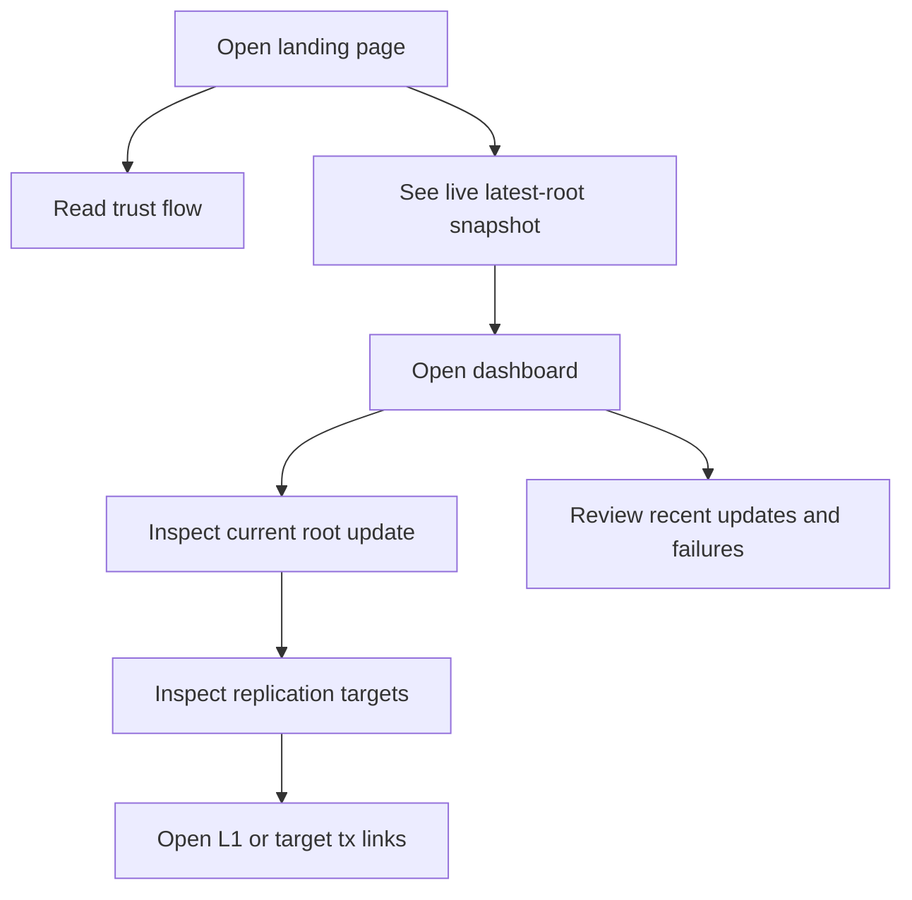
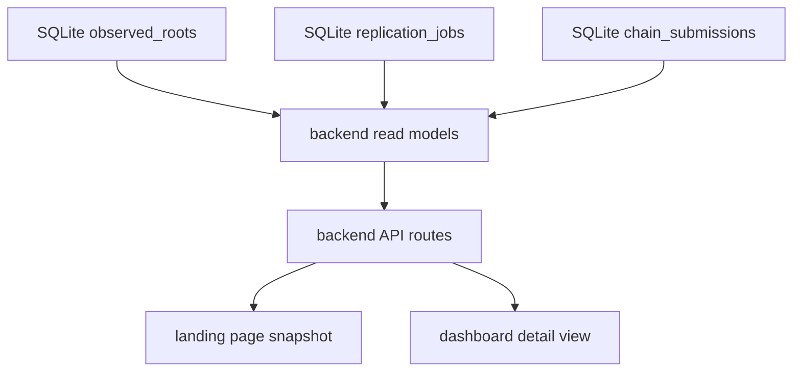

# feat: Phase 4 read-only API and frontend for World ID root replicator

## Overview

This plan narrows the master plan to Phase 4 only. The goal is to make the
running system observable through a small read-only API and a polished dark
frontend that feels precise, calm, and premium.

This phase carries forward the brainstorm decisions that the product has two
frontend surfaces, that the frontend remains read-only, and that the visual
direction must feel like a polished monitoring product rather than a wallet
app (see brainstorm:
`docs/brainstorms/2026-03-17-world-id-root-replicator-brainstorm.md`).

This phase also carries forward the Phase 3 rule that SQLite is the durable
source of truth for per-job and per-chain replication state. The API and
frontend must project that state clearly. They must not invent a separate
workflow model in the browser.

See brainstorm:
`docs/brainstorms/2026-03-17-world-id-root-replicator-brainstorm.md`
See master plan:
`docs/plans/2026-03-17-001-feat-world-id-root-replicator-plan.md`
See Phase 1:
`docs/plans/2026-03-17-002-feat-world-id-root-replicator-phase-1-foundation-plan.md`
See Phase 2:
`docs/plans/2026-03-17-003-feat-world-id-root-replicator-phase-2-proving-slice-plan.md`
See Phase 3:
`docs/plans/2026-03-17-004-feat-world-id-root-replicator-phase-3-multichain-fanout-plan.md`

## Problem statement

Phase 3 completed the multichain replication pipeline, but the product is still
operationally opaque. The current backend only exposes `GET /api/status`, and
the frontend still renders placeholder text in
`world-id-root-replicator/frontend/app/page.tsx` and
`world-id-root-replicator/frontend/app/dashboard/page.tsx`.

That is no longer enough for the product described in the brainstorm and master
plan. Readers need to understand, at a glance:

- which World ID root update was submitted to L1
- which Sepolia transaction submitted that root
- whether the system is waiting for Bankai finality or SP1 proving
- which replication targets are confirmed, in flight, blocked, or failed
- enough recent history to spot stale or broken replication without reading
  backend logs

The most important UX nuance in this phase is dependency visibility. When a new
root is detected but the shared pipeline is still in `waiting_finality`,
`ready_to_prove`, or `proof_in_progress`, the UI must show every replication
target as blocked by that upstream stage. It must not imply that per-chain
submission has already started when the shared proof prerequisite is not ready.

## Scope of this phase

This phase turns existing backend state into a stable read model and projects
that read model into a focused frontend experience.

Phase 4 includes:

- read-model queries and response types for the master-plan API surface
- route handlers under `world-id-root-replicator/backend/src/api/`
- a dark frontend application shell with a consistent layout and typography
- a landing page that explains the trust flow and shows a live product snapshot
- a dashboard that shows the latest root update, replication targets, recent
  jobs, and actionable failures
- responsive target visualization that scales beyond three chains without a
  redesign
- loading, empty, stale, and backend-error states for both frontend surfaces

Phase 4 excludes:

- any write endpoints or operator controls
- websockets, server-sent events, or other real-time transport
- authentication, wallets, or replay actions
- deployment work and `.env.example` cleanup that belong to Phase 5
- changes to proving or submission behavior beyond read-only shape fixes needed
  to expose existing state

## Current implementation status

The current codebase already contains most of the durable runtime state this
phase needs, but it does not yet expose that state in an operator-facing way.

Current facts:

- `world-id-root-replicator/backend/src/api/mod.rs` only exposes
  `GET /api/status`
- `world-id-root-replicator/backend/src/db.rs` already provides durable job and
  submission reads, including `next_active_job(...)` and
  `job_submissions(...)`
- `world-id-root-replicator/backend/migrations/0001_initial_schema.sql`
  already stores `observed_roots`, `replication_jobs`, and
  `chain_submissions`
- `world-id-root-replicator/backend/src/config.rs` already defines the version
  one destination set as Base Sepolia, OP Sepolia, and Arbitrum Sepolia
- `world-id-root-replicator/frontend/` only contains two placeholder pages and
  a README; it does not yet have a shared layout, global CSS, or a reusable
  data layer

This means Phase 4 is a hard cutover from placeholder observability surfaces to
real read models and real rendering. It is not a new workflow phase.

## Research findings that shape this phase

This section consolidates the local findings that matter for planning. There is
no `docs/solutions/` directory in this repository yet, so there are no
institutional learnings to inherit for this phase.

### Brainstorm decisions carried forward

The brainstorm already answered the product-shape questions, so this plan uses
those decisions directly.

- The frontend must remain read-only in version one (see brainstorm:
  `docs/brainstorms/2026-03-17-world-id-root-replicator-brainstorm.md:121`)
- The frontend must feel like a polished dark monitoring page, not a wallet app
  (see brainstorm:
  `docs/brainstorms/2026-03-17-world-id-root-replicator-brainstorm.md:74`)
- The product has two surfaces: a landing page and an operations dashboard
  (see brainstorm:
  `docs/brainstorms/2026-03-17-world-id-root-replicator-brainstorm.md:105`)
- The API must stay minimal and expose status, latest root, recent updates, and
  destination chains (see brainstorm:
  `docs/brainstorms/2026-03-17-world-id-root-replicator-brainstorm.md:63`)

### Master-plan decisions carried forward

The master plan already fixed the phase boundary and the required API surface.
This plan must stay within that boundary.

- Phase 4 is explicitly the read-only API and frontend phase (see master plan:
  `docs/plans/2026-03-17-001-feat-world-id-root-replicator-plan.md:398`)
- The backend must expose `GET /api/status`, `GET /api/roots/latest`,
  `GET /api/roots`, `GET /api/chains`, and `GET /api/jobs/:id` (see master
  plan:
  `docs/plans/2026-03-17-001-feat-world-id-root-replicator-plan.md:258`)
- The frontend must render current root, source block, chain cards, recent
  jobs, and errors (see master plan:
  `docs/plans/2026-03-17-001-feat-world-id-root-replicator-plan.md:402`)

### Phase 3 constraints carried forward

Phase 3 established the durable state model that Phase 4 must project.

- `replication_jobs.state` is the aggregate job state after proof generation
- `chain_submissions.state` remains the source of truth for per-target status
- per-chain tx hash and per-chain error message already exist and must stay
  visible to the API and frontend
- the UI must account for mixed outcomes, such as one confirmed target and one
  failed target, without collapsing those differences away

### Local code findings

The current implementation already exposes the exact seams that Phase 4 needs.

- `ObservedRoot` already stores `root_hex`, `source_block_number`, and
  `source_tx_hash`
- `ReplicationJobState` already distinguishes
  `WaitingFinality`, `ReadyToProve`, `ProofInProgress`, `ProofReady`,
  `Submitting`, `Completed`, and `Failed`
- `ChainSubmissionState` already distinguishes `Pending`, `Submitting`,
  `Confirmed`, and `Failed`
- `observed_roots.bankai_finalized_at` already indicates when the shared L1
  prerequisite has cleared
- `chain_submissions.tx_hash` and `chain_submissions.error_message` already
  support explorer links and failure details

## Research decision

Local context is strong enough that external research is not necessary for this
planning pass.

That is reasonable because:

- the brainstorm already fixed the product shape and visual direction
- the master plan already fixed the Phase 4 API boundary
- the current backend already exposes the state model we need to project
- the user provided a detailed design brief for the visual style

Implementation can still consult framework docs while coding, but that is not a
planning blocker.

## SpecFlow analysis

This section performs the Phase 4 specification-flow pass. It resolves the
major UI flows up front so the acceptance criteria cover both the happy path
and the awkward states that observability surfaces usually miss.

### User flow overview

The product only has one user role in version one: a read-only viewer. That
keeps the flows simple, but it raises the quality bar for clarity because the
UI cannot rely on control panels, retries, or hidden admin context.



The core user flows are:

1. A reader opens the landing page, learns the trust flow, and sees a current
   live snapshot of the latest replication status.
2. A reader opens the dashboard and inspects the newest root update that
   matters right now.
3. A reader sees that the pipeline is still upstream-blocked and immediately
   understands that every destination chain is waiting on L1 finality or
   proving.
4. A reader sees that fan-out has started and can distinguish confirmed,
   submitting, pending, and failed targets individually.
5. A reader uses the L1 transaction link or destination transaction links to
   inspect proof-related activity outside the app.
6. A reader encounters an empty dataset, stale backend, or API failure and gets
   a clear explanation instead of a blank dashboard.

### Flow permutations matrix

The dashboard must render the same data model cleanly across several important
state permutations.

| Scenario | Backend state | Required UI behavior |
| --- | --- | --- |
| No roots observed yet | No `observed_roots` rows | Show a calm empty state that explains the watcher is running and waiting for the first root |
| Root observed on L1 | `waiting_finality` | Show the L1 root card with a Sepolia tx link, and show every target as blocked by Bankai finality |
| Root finalized, proof not ready | `ready_to_prove` or `proof_in_progress` | Keep the same root card visible and show every target as blocked by proving |
| Proof ready, fan-out not started | `proof_ready` plus target `pending` rows | Show targets as queued for submission, not failed and not confirmed |
| Fan-out in progress | `submitting` plus mixed target rows | Render per-target states independently while keeping a shared stage banner |
| Fan-out complete | `completed` plus all target rows `confirmed` | Render success without operator controls and keep tx links accessible |
| Partial failure | `failed` or `submitting` plus mixed target rows | Keep confirmed targets confirmed, mark failed targets clearly, and show the shared job-level failure summary |
| Backend unavailable | Route fetch error or timeout | Render a non-destructive error surface with retry guidance and the last successful client render if available |

### Gaps resolved by default in this plan

Several implementation choices were unspecified before this planning pass. This
plan resolves them to avoid blocking Phase 4 work.

- The dashboard uses polling rather than live push. Use a simple periodic
  refresh on the dashboard and a lower-frequency live snapshot on the landing
  page.
- The dashboard treats the newest relevant job as the primary snapshot. If
  there is an in-flight job, show that job first. Otherwise, show the most
  recent completed job.
- The frontend never hard-codes exactly three targets in layout logic. It
  renders a list returned by the API.
- Explorer links are display metadata, not persistence data. Keep the database
  raw, and derive explorer URLs from a small chain metadata map in the
  frontend.
- Empty-state and error-state copy must explain the system state in plain
  language. Do not show raw JSON or stack traces in the main surface.

### Critical questions and chosen defaults

There are no blockers that require user input before planning can proceed. The
remaining ambiguities have safe defaults.

1. Which page owns the live data emphasis?
   Default: The landing page shows one concise live snapshot, and the dashboard
   carries the full operational detail.
2. Where should shared blocked states be derived?
   Default: Derive them in the backend API so the frontend can stay thin and
   consistent across pages.
3. How should future target growth affect layout?
   Default: Use a responsive target grid that auto-wraps from the API-provided
   list rather than a hard-coded three-column composition.

## Proposed solution

Build a small backend read layer and a minimal frontend component layer that
share one presentation model. Keep the code simple, and keep the UI sharp.

### Product surfaces

The two frontend pages serve different jobs and must not collapse into one
crowded screen.

#### Landing page

The landing page is the narrative entry point. It explains the trust model in
plain language and shows a compact live snapshot that proves the system is
running.

Recommended sections:

- a concise hero that explains what is being replicated and why
- a trust-flow explainer with the four shared pipeline stages
- a live snapshot card that shows the current root, source block, and overall
  replication status
- a restrained link into the full dashboard

#### Dashboard page

The dashboard is the operational surface. It focuses on one current root update
first, then on target fan-out, then on recent history.

Recommended layout:

1. a top-level service and freshness strip
2. one primary root-update card
3. one shared pipeline-stage banner
4. one replication-target grid
5. one recent-updates list or table

This keeps the most important answer near the top: what root is being
replicated right now, and where is it blocked or confirmed.

### Visual direction

The visual system must follow the user-provided design brief: dark, minimal,
structured, and premium. The product tone is confident and technical, not
playful.

Recommended design rules:

- Use a deep charcoal background with slightly lighter surface layers.
- Use subtle borders and low-contrast separators rather than loud fills.
- Use one restrained cool accent for links, focus rings, and active emphasis.
- Use sharp typography with a clean sans for headings and UI text, plus a mono
  face for hashes, block numbers, and tx fragments.
- Keep radii smooth but not pillowy. Components must feel precise, not soft.
- Use motion sparingly. Favor soft opacity and translate transitions.
- Avoid loud gradients, big glows, oversized cards, and decorative clutter.

Recommended visual hierarchy:

- Make the root-update card the primary visual anchor.
- Make the shared stage banner secondary but unmistakable.
- Make target cards compact and information-dense.
- Keep recent history lower in contrast than the current snapshot.

### API design

The backend API must remain small, but the response shapes must be more
dashboard-oriented than the current placeholder health response.

Implement these endpoints:

- `GET /api/status`
  service health, last proof-request age, destination count, and a basic
  freshness summary
- `GET /api/roots/latest`
  one current snapshot for the landing page and dashboard header
- `GET /api/roots`
  recent root updates with aggregate and per-target summaries
- `GET /api/chains`
  configured destination chains plus latest known submission per chain
- `GET /api/jobs/:id`
  one detailed job with all target rows

The API must derive presentation-ready state that the frontend can trust. Do
not make the frontend reverse-engineer job meaning from raw SQL rows.

Recommended response model:

```ts
// world-id-root-replicator/frontend/lib/api.ts
export type RootSnapshot = {
  jobId: number;
  rootHex: string;
  sourceBlockNumber: number;
  sourceTxHash: string;
  observedAt: string;
  bankaiFinalizedAt: string | null;
  jobState:
    | "waiting_finality"
    | "ready_to_prove"
    | "proof_in_progress"
    | "proof_ready"
    | "submitting"
    | "completed"
    | "failed";
  stageLabel: string;
  stageDescription: string;
  blockedBy: "bankai_finality" | "proving" | null;
  errorMessage: string | null;
  targets: ReplicationTarget[];
};

export type ReplicationTarget = {
  chainName: string;
  chainId: number;
  registryAddress: string;
  submissionState: "pending" | "submitting" | "confirmed" | "failed";
  txHash: string | null;
  errorMessage: string | null;
  displayState: "blocked" | "queued" | "submitting" | "confirmed" | "failed";
  blockedReason: string | null;
};
```

This keeps the frontend simple and future-proof. It also keeps the blocked
state consistent across the landing page and the dashboard.

### State-to-UI mapping rules

The blocked-state rules are the most important logic in this phase. Lock them
before implementation so the UI does not drift into misleading status copy.

Use these mappings:

- `waiting_finality`
  show the root update as detected on L1 and show every target as `blocked`
  with reason `Waiting for Bankai finality`
- `ready_to_prove` or `proof_in_progress`
  show the root update as finalized or proving, and show every target as
  `blocked` with reason `Generating SP1 proof`
- `proof_ready` with target `pending`
  show targets as `queued`
- `submitting` with target `pending`
  show those targets as `queued`
- `submitting` with target `submitting`
  show those targets as `submitting`
- any target `confirmed`
  show it as `confirmed` even if another target failed
- any target `failed`
  show it as `failed` with its own error detail
- job `failed` before any target tx exists
  show a job-level failure banner and keep targets blocked or failed according
  to the last durable state

These rules make the causal chain legible:

L1 detection -> Bankai finality -> proving -> fan-out -> per-target settlement

### Visualization model for future target growth

The target visualization must not assume that version one will remain the final
target set.

Use these layout rules:

- Render targets from a list, not from three hard-coded slots.
- Use a responsive grid or stacked layout that works for three, five, or more
  targets.
- Keep the primary L1 root-update card separate from the target list so the
  fan-out area can grow independently.
- Keep all shared upstream stages outside the individual target cards so the UI
  does not duplicate the same explanation in every card.

This yields a simple visual grammar:

one source card above, many target cards below

That grammar scales better than a bespoke three-target diagram.

## File and module plan

The implementation can stay small if it introduces only a few focused files.
Do not add a heavy design system or a large frontend state framework.

### Backend

Create or extend these backend files:

- `world-id-root-replicator/backend/src/api/mod.rs`
  route composition and top-level handlers
- `world-id-root-replicator/backend/src/api/read_models.rs`
  response structs and state-to-display derivation
- `world-id-root-replicator/backend/src/db.rs`
  read-only query helpers for latest snapshot, recent jobs, chain summaries, and
  job detail

### Frontend

Create or extend these frontend files:

- `world-id-root-replicator/frontend/app/layout.tsx`
  shared shell and metadata
- `world-id-root-replicator/frontend/app/globals.css`
  dark theme tokens, base styles, and component primitives
- `world-id-root-replicator/frontend/app/page.tsx`
  landing page
- `world-id-root-replicator/frontend/app/dashboard/page.tsx`
  dashboard page
- `world-id-root-replicator/frontend/components/root-update-card.tsx`
  current root snapshot
- `world-id-root-replicator/frontend/components/pipeline-stage-banner.tsx`
  shared upstream stage explanation
- `world-id-root-replicator/frontend/components/replication-target-grid.tsx`
  dynamic target list wrapper
- `world-id-root-replicator/frontend/components/replication-target-card.tsx`
  per-target status card
- `world-id-root-replicator/frontend/components/recent-updates-list.tsx`
  recent history surface
- `world-id-root-replicator/frontend/components/status-badge.tsx`
  shared status treatment
- `world-id-root-replicator/frontend/lib/api.ts`
  backend fetch helpers and types
- `world-id-root-replicator/frontend/lib/chain-metadata.ts`
  labels, explorer URLs, and restrained color accents per target

## Recommended implementation order

This order keeps the read model stable first and delays visual polish until the
data shape is locked.

1. Add backend read-only queries.
2. Add API response models and routes.
3. Lock the state-to-display mapping rules.
4. Build the shared frontend shell and theme tokens.
5. Build the landing page around the latest snapshot.
6. Build the dashboard around the same snapshot plus recent updates.
7. Polish loading, empty, stale, and error states.

## Phase steps

This section translates the recommended order into concrete execution steps and
acceptance checks.

### Step 1: build backend read models

Start by defining the read-only query layer. This is the main dependency for
everything else in the phase.

Deliverables:

- add one latest-root snapshot query in
  `world-id-root-replicator/backend/src/db.rs`
- add one recent-roots query in
  `world-id-root-replicator/backend/src/db.rs`
- add one per-chain summary query in
  `world-id-root-replicator/backend/src/db.rs`
- add one job-detail query in
  `world-id-root-replicator/backend/src/db.rs`

Acceptance checks:

- the latest snapshot includes `source_tx_hash`, `source_block_number`, job
  state, and target rows
- the query layer does not mutate any workflow state
- the latest snapshot can represent both in-flight and completed jobs

### Step 2: expose the Phase 4 API surface

Once the read model exists, expose it through a stable JSON API that mirrors
the master-plan endpoint list.

Deliverables:

- expand `world-id-root-replicator/backend/src/api/mod.rs` beyond
  `GET /api/status`
- add response structs in
  `world-id-root-replicator/backend/src/api/read_models.rs`
- serialize presentation-ready stage labels and blocked-state information

Acceptance checks:

- all five Phase 4 endpoints return valid JSON
- `GET /api/roots/latest` returns display-ready stage and blocked-state fields
- `GET /api/jobs/:id` returns per-target tx hashes and failure messages

### Step 3: establish the frontend shell and dark theme

After the API shape is stable, build the minimum shared frontend shell needed
to support both pages cleanly.

Deliverables:

- add `world-id-root-replicator/frontend/app/layout.tsx`
- add `world-id-root-replicator/frontend/app/globals.css`
- add typography, spacing, color tokens, surface tokens, and status tokens
- create a restrained navigation pattern between landing page and dashboard

Acceptance checks:

- both pages share the same dark visual language
- the shell feels premium and minimal rather than placeholder-like
- hashes, block numbers, and tx fragments are readable on dark surfaces

### Step 4: build the landing page

The landing page must explain the trust model clearly and provide a concise live
snapshot without becoming a duplicate of the dashboard.

Deliverables:

- replace the placeholder in
  `world-id-root-replicator/frontend/app/page.tsx`
- add a trust-flow explainer section
- add a compact live snapshot card driven by `GET /api/roots/latest`
- add a clear route into `/dashboard`

Acceptance checks:

- the landing page explains the L1 -> finality -> proving -> fan-out flow in
  plain language
- the live snapshot shows the current root, source block, and overall status
- the page remains calm and uncluttered on mobile and desktop

### Step 5: build the dashboard

The dashboard must show the current root update first and make blocked versus
per-target progress immediately legible.

Deliverables:

- replace the placeholder in
  `world-id-root-replicator/frontend/app/dashboard/page.tsx`
- add `root-update-card.tsx`, `pipeline-stage-banner.tsx`,
  `replication-target-grid.tsx`, `replication-target-card.tsx`, and
  `recent-updates-list.tsx`
- add a small `chain-metadata.ts` map for explorer links and labels

Acceptance checks:

- the current root update shows a Sepolia source tx link
- the target area renders from API data and does not assume exactly three cards
- `waiting_finality` and proving states visibly block all targets
- mixed target outcomes remain visible and are not collapsed into one generic
  status

### Step 6: harden loading, empty, stale, and failure states

The last step makes the surface trustworthy when the system is not in the happy
path.

Deliverables:

- add empty-state copy for a fresh deployment
- add stale or unavailable-backend UI treatment
- add lightweight refresh indicators or timestamp freshness hints
- keep failure copy short, specific, and visible

Acceptance checks:

- a fresh deployment does not render blank cards or fake zero values
- a broken backend does not crash the frontend render
- a failed target exposes enough detail to guide debugging

## Alternative approaches considered

Several alternatives were possible, but they do not fit the version-one goals
as well as the chosen plan.

### One combined page

It would be possible to collapse the landing page and dashboard into one page.
Reject that approach. The brainstorm explicitly defined two surfaces, and one
combined page would either bury the product explanation or crowd the monitoring
surface.

### Hard-coded three-target dashboard

It would be possible to design the dashboard as a fixed Base/OP/Arbitrum row.
Reject that approach. The user explicitly wants future target growth, and the
brainstorm treated destination chains as configuration, not as permanent visual
slots.

### Realtime streaming transport

It would be possible to add websockets or server-sent events now. Reject that
approach for version one. Polling is enough for an observability-first example
and keeps the implementation aligned with the simple architecture chosen in the
brainstorm.

### Decorative marketing-first visual language

It would be possible to lean on gradients, glows, and oversized hero sections.
Reject that approach. The user requested a restrained Vercel- or Linear-like
dark product tone, and the dashboard must optimize for clarity over ornament.

## System-wide impact

This phase does not change the proving pipeline, but it changes how backend
state gets consumed and interpreted across the system.

### Interaction graph

Phase 4 adds a new read path from SQLite to operators and readers.



### Error and failure propagation

The highest-risk failure modes in this phase are read-model drift and misleading
presentation.

Important failure cases:

- the API omits target rows when the job exists
- the UI shows a target as pending submission when the pipeline is still
  blocked by finality or proving
- the frontend hides per-target errors behind one generic job badge
- the dashboard breaks when the backend returns no rows or partial data

Required handling:

- derive shared blocked states in one place
- keep per-target errors visible at target-card level
- keep the latest snapshot renderable even when recent history fails to load

### State lifecycle risks

The biggest observability risks are semantic, not storage-related.

- The newest relevant job selection could drift from the runner's real meaning.
- The landing page and dashboard could derive different blocked-state logic.
- Explorer links could break if chain metadata lives in too many places.
- Recent-history queries could accidentally prefer stale completed jobs over the
  latest in-flight root.

### API surface parity

The API must reflect the durable job and target state that Phase 3 writes. It
must not collapse the model so aggressively that future UI work has to rebuild
state from logs or raw tables.

Specifically preserve:

- source tx hash on the latest root snapshot
- job-level state and job-level failure message
- per-target submission state
- per-target tx hash and error message
- chain identity separate from display metadata

### Integration test scenarios

The cross-layer scenarios that matter most in Phase 4 are:

1. a detected root is visible in the dashboard before it is finalized
2. a proving-in-progress root blocks all targets visually
3. one confirmed target and one failed target remain distinct in the same job
4. a fresh deployment with no rows renders a calm empty state
5. the landing page and dashboard agree on the latest shared stage label

## Acceptance criteria

This section defines the measurable bar for Phase 4 completion.

### Functional requirements

- [x] `GET /api/status`, `GET /api/roots/latest`, `GET /api/roots`,
      `GET /api/chains`, and `GET /api/jobs/:id` are implemented in
      `world-id-root-replicator/backend/src/api/`
- [x] the latest snapshot exposes `root_hex`, `source_block_number`,
      `source_tx_hash`, job state, shared stage metadata, and per-target rows
- [x] the landing page explains the trust model and shows a live snapshot
- [x] the dashboard shows one primary root update, one shared stage banner, one
      target grid, and recent history
- [x] a root detected on L1 but not yet finalized visibly blocks all targets
- [x] a proving-in-progress root visibly blocks all targets
- [x] mixed target outcomes remain visible on the dashboard
- [x] target visualization renders from a list and remains usable when more
      targets are added later

### Non-functional requirements

- [x] the frontend stays fully read-only
- [x] the visual design follows the dark, minimal, premium brief in this plan
- [x] the frontend stays small and does not introduce a heavy design system or
      large client-state framework
- [x] the dashboard remains readable on both desktop and mobile layouts

### Quality gates

- [x] backend route tests cover the latest snapshot, blocked states, and mixed
      target outcomes
- [x] the frontend builds successfully with the new pages and components
- [x] manual browser review confirms empty, loading, success, and failure
      states on both landing page and dashboard

## Success metrics

This phase succeeds when the product becomes understandable without reading
logs.

- A reader can identify the newest replicated root and its L1 source tx within
  a few seconds of opening the dashboard.
- A reader can tell whether the system is blocked on finality, blocked on
  proving, or actively fanning out to targets without cross-referencing backend
  state names.
- A failed or stale target is visually obvious without overwhelming the rest of
  the interface.

## Dependencies and risks

This phase depends more on stable state semantics than on new infrastructure.

- If the backend does not return one consistent latest snapshot, the landing
  page and dashboard will drift.
- If blocked-state derivation lives in multiple places, the UI will eventually
  contradict itself.
- If the frontend assumes exactly three targets, future target growth will
  force a redesign instead of a straightforward extension.
- If the frontend requires too much environment wiring, implementation may
  leak Phase 5 concerns into Phase 4. Keep runtime config minimal.

## Documentation plan

This phase mainly changes runtime surfaces, but the implementation must still
leave the project easier to understand.

Recommended doc follow-ups during coding:

- update `world-id-root-replicator/frontend/README.md` once the placeholder
  pages are replaced
- update `world-id-root-replicator/README.md` to mention the new API and
  frontend surfaces after implementation lands

## Sources and references

This plan originates from the brainstorm and carries forward its key product
decisions without changing the core architecture.

### Origin

- **Brainstorm document:**
  `docs/brainstorms/2026-03-17-world-id-root-replicator-brainstorm.md`
  Key decisions carried forward:
  - keep the frontend read-only
  - use a dark polished monitoring surface
  - keep the API small and status-oriented

### Internal references

- Phase 4 boundary in master plan:
  `docs/plans/2026-03-17-001-feat-world-id-root-replicator-plan.md:398`
- Master-plan API surface:
  `docs/plans/2026-03-17-001-feat-world-id-root-replicator-plan.md:258`
- Brainstorm product shape:
  `docs/brainstorms/2026-03-17-world-id-root-replicator-brainstorm.md:105`
- Current API placeholder:
  `world-id-root-replicator/backend/src/api/mod.rs:4`
- Current job and target state enums:
  `world-id-root-replicator/backend/src/jobs/types.rs:13`
- Current observed-root and target row creation:
  `world-id-root-replicator/backend/src/db.rs:140`
- Current next-job and submission reads:
  `world-id-root-replicator/backend/src/db.rs:310`
- Current destination-chain config:
  `world-id-root-replicator/backend/src/config.rs:8`
- Current landing placeholder:
  `world-id-root-replicator/frontend/app/page.tsx:1`
- Current dashboard placeholder:
  `world-id-root-replicator/frontend/app/dashboard/page.tsx:1`

### External references

- External research intentionally skipped for this planning pass because the
  local brainstorm, master plan, and current codebase already define the needed
  product and technical constraints.

### Related work

- Master plan:
  `docs/plans/2026-03-17-001-feat-world-id-root-replicator-plan.md`
- Completed Phase 1 foundation:
  `docs/plans/2026-03-17-002-feat-world-id-root-replicator-phase-1-foundation-plan.md`
- Completed Phase 2 proving slice:
  `docs/plans/2026-03-17-003-feat-world-id-root-replicator-phase-2-proving-slice-plan.md`
- Completed Phase 3 multichain fan-out:
  `docs/plans/2026-03-17-004-feat-world-id-root-replicator-phase-3-multichain-fanout-plan.md`
