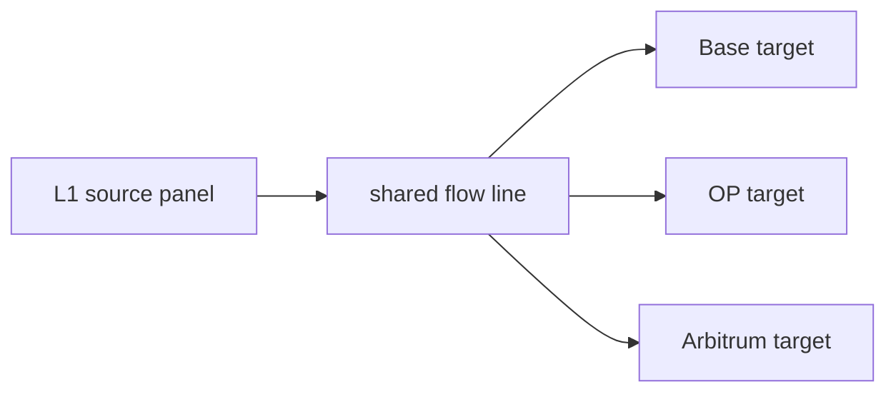
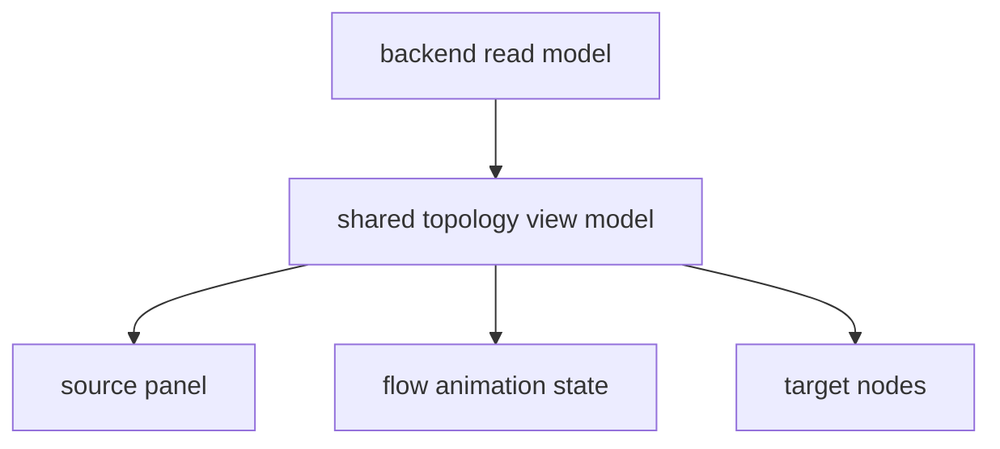

# refactor: Simplify World ID root replicator UI to a topology-first view

## Overview

This plan corrects the current Phase 4 frontend direction. The existing UI
solves the data-display problem, but it misses the product brief: it is too
crowded, too tile-heavy, and too verbose. The next iteration must be a hard
cutover to a topology-first interface that feels black, calm, precise, and
minimal.

This redesign keeps the brainstorm's core product decisions intact: the
frontend remains read-only, it still explains the replication flow, and it
still shows where the root has been replicated and with what status (see
brainstorm:
`docs/brainstorms/2026-03-17-world-id-root-replicator-brainstorm.md`).
What changes is the presentation model, not the underlying workflow.

The attached user sketch becomes the primary visual reference for this plan.
The core composition is:

- one L1 source panel on the left
- one animated fan-out path from source to destinations
- one target stack on the right
- one title and a minimal footer framing the canvas

Everything else becomes optional and is out of scope for this pass.

See brainstorm:
`docs/brainstorms/2026-03-17-world-id-root-replicator-brainstorm.md`
See master plan:
`docs/plans/2026-03-17-001-feat-world-id-root-replicator-plan.md`
See superseded Phase 4 plan:
`docs/plans/2026-03-17-005-feat-world-id-root-replicator-phase-4-read-only-api-frontend-plan.md`

## Problem statement

The current frontend implementation ships too much interface for the job it
needs to do.

The user feedback is unambiguous:

- the layout feels crowded
- there are too many tiles
- there is too much information competing for attention
- the result does not feel minimal

That matters because the product goal is not "show all available data." The
goal is to make the replication lifecycle legible at a glance. The strongest
signal in this product is directional:

L1 source state -> proving/finality state -> target replication state

The current UI dilutes that signal by spreading status into many parallel
sections, cards, badges, lists, and headings. The redesign must reverse that.

## Scope of this refactor

This refactor narrows the frontend to one visual story and aggressively removes
everything that does not support it.

Included in scope:

- replace the current multi-section landing page with a minimal topology view
- replace the current dashboard with the same topology-first status canvas
- use a true black color foundation instead of charcoal-heavy surfaces
- keep only a title, the topology canvas, and an optional minimal footer
- animate the flow from source to targets in a calm, steady way
- preserve links to the L1 tx, Bankai-finalized block, and destination txs
- preserve future target growth in the target layout

Explicitly out of scope:

- metric strips
- trust-model explainer cards
- recent updates lists or tables
- inventory sidebars
- multiple competing sections on the same page
- decorative dashboard chrome
- any new write controls or operator actions
- major backend API expansion beyond what the topology view needs

## Current implementation status

The current codebase already has enough backend data to drive the desired UI,
but the presentation layer is overbuilt for the use case.

Current frontend facts:

- `world-id-root-replicator/frontend/app/page.tsx` currently renders a large
  hero plus extra supporting sections
- `world-id-root-replicator/frontend/app/dashboard/page.tsx` currently renders
  metric cards, a large root card, a stage banner, a target grid, a chain
  inventory block, and recent history
- the current component set is optimized for modular dashboard sections rather
  than one compositional canvas
- the current theme uses dark surfaces, but not the stricter black-first
  palette requested in the latest feedback

Current backend facts:

- the read-only API surface already exists and is broadly sufficient
- the latest snapshot already exposes source tx hash, shared stage state, and
  per-target state
- blocked-state derivation already happens in the backend, which is worth
  keeping because it makes the frontend thinner and more consistent

This means the right move is a hard cutover in the frontend presentation layer,
not another additive UI iteration.

## Research findings that shape this plan

There is no `docs/solutions/` directory in this repository yet, so there are
no institutional learnings to inherit for this refactor.

### Brainstorm decisions carried forward

The brainstorm still governs the product boundaries.

- The frontend stays read-only in version one (see brainstorm:
  `docs/brainstorms/2026-03-17-world-id-root-replicator-brainstorm.md:121`)
- The frontend must feel like a polished dark monitoring page, not a wallet app
  (see brainstorm:
  `docs/brainstorms/2026-03-17-world-id-root-replicator-brainstorm.md:74`)
- The dashboard must show where the root has been replicated and with what
  status (see brainstorm:
  `docs/brainstorms/2026-03-17-world-id-root-replicator-brainstorm.md:115`)
- Reliability and clarity matter more than maximum throughput or feature width
  (see brainstorm:
  `docs/brainstorms/2026-03-17-world-id-root-replicator-brainstorm.md:25`)

### Master-plan constraints carried forward

This refactor remains inside Phase 4. It does not reopen backend orchestration
or contract scope.

- The API must remain read-only
- The frontend must explain the trust model clearly
- The dashboard must reflect real backend state without operator-only controls

### Local code findings

The current implementation already proves two useful things:

- the backend can provide the state needed for a topology view
- the current UI can be simplified by removal rather than by adding more
  intermediate components

The frontend should reuse only the pieces that help the final composition.
Anything that exists only to support the current crowded structure should be
deleted or folded away.

## Research decision

External research is not necessary for this planning pass.

The local context is already strong:

- the brainstorm defines the product boundaries
- the current code shows exactly what is too heavy
- the user provided explicit qualitative feedback
- the attached sketch defines the preferred information architecture

## SpecFlow analysis

This section validates the new UI against the actual states the product must
communicate.

### Core user flow

The desired experience is a single scanning motion:

1. read the title
2. inspect the source panel on the left
3. follow the animated path from the source toward the targets
4. inspect the state of each target on the right

That motion matches the actual system lifecycle much better than a collection
of separate cards.

### State permutations the topology must handle

The composition must stay stable while the status inside it changes.

| Scenario | Source panel state | Arrow state | Target state |
| --- | --- | --- | --- |
| No root observed yet | idle, no tx link | dormant, faint | targets show waiting/idle |
| Root observed on L1 | tx link active, finalized waiting, proven no, replicated no | faint movement begins near source | all targets show waiting on source |
| Finalized in Bankai | tx link active, Bankai link active, proven no | motion extends farther right | all targets still waiting on proof |
| Proving in progress | proven no, replication not triggered | calm steady motion across branches | all targets still blocked, but visibly downstream |
| Replication triggered | replicated yes | branch motion active | some or all targets transition to submitting |
| Partial completion | replicated yes | branch motion stronger on active paths | one target confirmed, one waiting, one failed |
| Full completion | all source states complete | motion can settle or soften | every target confirmed |

### Design gaps resolved by default

This plan resolves a few ambiguities so implementation can stay decisive.

1. Two routes vs one route:
   Keep both `/` and `/dashboard` for product-shape parity, but render the same
   topology-first canvas with only minor framing differences.
2. Animation style:
   Use calm, steady CSS motion. No flashy pulses, no aggressive glow trails, no
   noisy particle systems.
3. Empty-state behavior:
   Do not add extra explanatory sections. Keep the same topology layout and let
   the left source panel describe the waiting state.
4. Future target growth:
   The branch system must support more destinations later. The initial version
   may hard-code the three current destinations visually, but the target
   components must still render from data and degrade cleanly if more are added.

## Proposed solution

Replace the current dashboard composition with one premium black canvas.

### Visual architecture

The page structure should be:

1. minimal header with title
2. topology canvas
3. minimal footer, if needed

The topology canvas contains only three zones:

- `source zone` on the left
- `flow zone` in the middle
- `target zone` on the right

The layout should feel airy and restrained, with much more negative space than
the current version.

### Source zone

The left source block is the primary information anchor. It should be compact,
high-signal, and text-light.

Show only:

- source label, for example `Ethereum Sepolia`
- observed tx state, with tx link once seen
- finalized state, with Bankai block link once finalized
- proven state, yes or no
- replication-triggered state, yes or no

Recommended treatment:

- monochrome or low-color text
- one small bordered panel or inline block, not a large hero card
- status rows with strong alignment
- link text kept short and truncated

### Flow zone

The center of the page communicates direction, not data density.

Requirements:

- a main line exits the source
- that line branches toward each target
- one subtle animated marker or pulse moves from left to right
- branch animation stays calm and steady
- inactive paths are dimmer than active paths
- motion respects `prefers-reduced-motion`

This zone is where the "dynamic feel" should live. The motion must be elegant,
not loud.

### Target zone

The right side shows one compact node per destination chain.

For each target, show only:

- chain name
- registry contract address
- status
- destination tx link, if it exists
- short failure message only when needed

Recommended treatment:

- vertically stacked target blocks
- more whitespace between targets than inside targets
- state-driven emphasis, with black background and restrained borders
- no extra surrounding dashboards, inventory panels, or summary cards

### Black-first visual direction

The new theme must use proper black as the foundation.

Recommended palette direction:

- page background at or near `#000000`
- surfaces only slightly lifted from black
- borders as faint graphite or cool gray
- one restrained light accent for active motion and focus
- white and near-white typography with muted gray secondary text

Avoid:

- mid-charcoal page backgrounds
- large filled panels
- glossy gradients
- obvious SaaS dashboard blue-tile patterns

## Technical approach

This refactor should prefer deletion and simplification over further UI
abstraction.

### Frontend strategy

Refactor the frontend around one shared topology component and trim the rest.

Create or consolidate around:

- `world-id-root-replicator/frontend/components/topology-canvas.tsx`
- `world-id-root-replicator/frontend/components/source-status-panel.tsx`
- `world-id-root-replicator/frontend/components/replication-flow.tsx`
- `world-id-root-replicator/frontend/components/target-status-node.tsx`

Delete or stop using components whose only purpose was the previous crowded
layout, including:

- metric strips
- stage-banner sections
- trust cards
- recent-updates lists for the main surfaces
- chain inventory panels

### Backend/API strategy

Prefer reusing the current API surface and read models.

Only add backend work if one of these is truly needed:

- a Bankai block URL or Bankai block identifier is missing from the current
  snapshot
- the current latest snapshot does not expose enough information to drive the
  left source panel cleanly
- the frontend would otherwise have to infer too much state locally

If the API is already sufficient, do not expand it further in this refactor.

### Motion strategy

Use CSS-only animation where possible.

Recommended motion primitives:

- one translating dot or soft marker along each active path
- one low-contrast shimmer or stroke animation for active branches
- gentle opacity transitions when states change

Do not introduce heavy animation libraries unless the implementation becomes
impossible without them.

## Alternative approaches considered

### Keep the current dashboard and just trim some cards

Reject this. The current structure is wrong at the composition level, not just
at the content-density level. Small edits would leave the same crowded logic in
place.

### Build a dense network graph

Reject this. The user wants something simple and minimal, not a complex graph
visualization.

### Add more summaries and make them collapsible

Reject this. Collapsing content still keeps the wrong information architecture.
The goal is to remove competing sections, not hide them.

## System-wide impact

### Interaction graph

The main system impact is on the read path, not the write path.

### Error and failure propagation

The biggest failure risk in this refactor is semantic confusion:

- source state and target state could drift apart visually
- arrows could imply progress that the source state does not justify
- over-styled motion could make failure states less readable

Required handling:

- source truth for blocked-state logic stays centralized
- active animation only appears where the underlying state warrants it
- target failures remain visible without expanding the whole page into another
  dashboard

### State lifecycle risks

The highest-risk mistakes are:

- showing replication as triggered before it really is
- showing target progress while proofing is still blocked upstream
- losing target-specific tx and status detail in the name of minimalism
- hard-coding the composition so rigidly that adding more targets becomes
  painful

### API surface parity

This refactor must preserve visibility into:

- source tx hash
- finality state and Bankai reference
- proof state
- replication-trigger state
- per-target tx hash
- per-target status and failure

If any of those disappear, the UI becomes prettier but less useful.

### Integration test scenarios

This refactor needs validation for:

1. source observed, all targets waiting
2. source finalized, proving pending, all targets still blocked
3. one target confirmed while another is still submitting
4. one target failed while others are healthy
5. no roots yet, but the topology still renders elegantly

## File and module plan

Planned touch points:

- `world-id-root-replicator/frontend/app/page.tsx`
- `world-id-root-replicator/frontend/app/dashboard/page.tsx`
- `world-id-root-replicator/frontend/app/globals.css`
- `world-id-root-replicator/frontend/components/`
- optionally `world-id-root-replicator/frontend/lib/chain-metadata.ts`
- optionally `world-id-root-replicator/backend/src/api/read_models.rs`

## Recommended implementation order

1. Define the simplified topology view model.
2. Strip the current routes down to minimal framing.
3. Build the left source panel.
4. Build the animated branch flow.
5. Build the right target nodes.
6. Tune spacing, black palette, and motion restraint.
7. Validate empty, waiting, partial, and complete states.

## Acceptance criteria

### Functional requirements

- [x] the main UI consists only of a title/header, a topology-first status
      canvas, and an optional minimal footer
- [x] the left side shows the L1 source and these states: observed tx,
      finalized, proven, and replication triggered
- [x] the observed tx becomes a link once present
- [x] the finalized state becomes a Bankai block link once present
- [x] the right side shows one compact target block per destination chain
- [x] each target block shows chain name, contract address, status, and tx link
      when available
- [x] a branching arrow or line connects source to each target
- [x] calm left-to-right animation communicates active flow from source to
      targets
- [x] the topology still reads correctly when all targets are waiting
- [x] the topology still reads correctly when target outcomes are mixed

### Non-functional requirements

- [x] the page uses proper black as the color foundation
- [x] the design feels sparse, minimal, and premium rather than dashboard-like
- [x] the animation remains subtle and respects reduced-motion preferences
- [x] the layout remains readable on desktop and mobile

### Quality gates

- [x] any removed UI sections are actually deleted or unused, not merely hidden
- [x] the frontend builds successfully after the refactor
- [x] manual browser review confirms the topology view in empty, waiting,
      proving, and mixed-target states

## Success metrics

- A viewer can understand the whole replication state by reading left to right
  in one pass.
- The UI no longer feels like a multi-panel dashboard.
- The source-to-target relationship is the first thing a viewer notices.

## Dependencies and risks

- If the current API lacks Bankai-link data, a small backend addition may be
  required.
- If the animation is too prominent, the premium feel will collapse into visual
  noise.
- If too much detail is removed, target troubleshooting value will regress.

## Documentation plan

After implementation:

- update `world-id-root-replicator/frontend/README.md` to describe the
  topology-first UI
- update `world-id-root-replicator/README.md` if the user-facing description of
  the frontend changes materially

## Sources and references

### Origin

- **Brainstorm document:**
  `docs/brainstorms/2026-03-17-world-id-root-replicator-brainstorm.md`
  Key decisions carried forward:
  - keep the frontend read-only
  - keep the UI dark and monitoring-oriented
  - show where the root has been replicated and with what status

### Internal references

- Current Phase 4 plan that this refactor corrects:
  `docs/plans/2026-03-17-005-feat-world-id-root-replicator-phase-4-read-only-api-frontend-plan.md`
- Current landing route:
  `world-id-root-replicator/frontend/app/page.tsx`
- Current dashboard route:
  `world-id-root-replicator/frontend/app/dashboard/page.tsx`
- Current API read model:
  `world-id-root-replicator/backend/src/api/read_models.rs`

### Design references

- User-provided topology sketch from the March 17, 2026 planning conversation
- User feedback in this conversation requiring a black, minimal, topology-first
  redesign

### External references

- External research intentionally skipped for this planning pass because the
  user-provided sketch, the brainstorm, and the current implementation already
  define the relevant constraints.

### Related work

- Master plan:
  `docs/plans/2026-03-17-001-feat-world-id-root-replicator-plan.md`
- Completed initial Phase 4 UI plan:
  `docs/plans/2026-03-17-005-feat-world-id-root-replicator-phase-4-read-only-api-frontend-plan.md`
