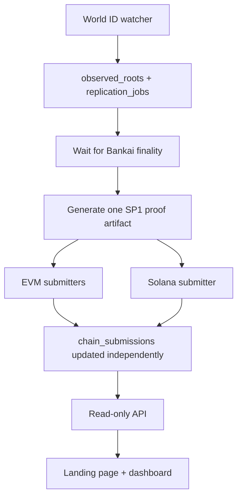

# feat: Add Solana Devnet destination support to World ID root replicator

## Overview

This plan extends the current EVM-only destination fan-out with the first
non-EVM target: Solana Devnet. It keeps the core brainstorm decisions intact:
one Rust backend, one SQLite database, one SP1 proof artifact per observed
World ID root, and one read-only frontend that reports per-target replication
state (see brainstorm: `docs/brainstorms/2026-03-17-world-id-root-replicator-brainstorm.md`).

This work intentionally revisits the brainstorm's earlier decision to defer
non-EVM destinations until later (see brainstorm:
`docs/brainstorms/2026-03-17-world-id-root-replicator-brainstorm.md:45`).
The user now wants Solana Devnet as the first non-EVM chain, and the existing
repo is mature enough to absorb that change as a hard cutover rather than as an
experimental sidecar.

## Problem statement

The current replicator is multichain only in the EVM sense. It can prove a
single Bankai-backed World ID root update and fan that proof out to Base
Sepolia, OP Sepolia, and Arbitrum Sepolia, but it has no way to deploy,
initialize, submit to, confirm on, or visualize a Solana target.

The current code makes those EVM assumptions in a few concrete places:

- `world-id-root-replicator/backend/src/jobs/types.rs:33` only defines three
  EVM destination variants.
- `world-id-root-replicator/backend/src/config.rs:64` only loads EVM env groups.
- `world-id-root-replicator/backend/src/chains/mod.rs:23` defines a submission
  trait around an EVM `Address`, and
  `world-id-root-replicator/backend/src/chains/mod.rs:32` only implements an
  EVM calldata sender.
- `world-id-root-replicator/backend/src/jobs/runner.rs:47` always constructs
  `EvmSubmitter`.
- `world-id-root-replicator/backend/src/api/read_models.rs:69` and
  `world-id-root-replicator/frontend/lib/chain-metadata.ts:1` still project the
  target model through EVM-oriented naming and explorer URLs.

At the same time, the proof side is already chain-agnostic enough to reuse.
The SP1 guest still commits ABI-encoded `(uint64 source_block_number, bytes32
root)` public values in `world-id-root-replicator/program/src/main.rs:43`, and
the backend already loads those bytes as a portable artifact in
`world-id-root-replicator/backend/src/proving/sp1.rs:14`.

There is also no `docs/solutions/` directory in this repository yet, so there
are no institutional learnings to inherit. The planning pass needs to rely on
the local code, the existing brainstorm, and external primary sources.

## Research findings

This section consolidates the repo research, the external Solana research, and
the user-provided reference implementation.

### Brainstorm decisions carried forward

The brainstorm still sets the architecture rules for this plan:

- Keep the product as one Rust application with one shared SQLite database
  (see brainstorm:
  `docs/brainstorms/2026-03-17-world-id-root-replicator-brainstorm.md:31`).
- Keep the SP1 guest close to the current example and keep the public output as
  `root + source block number` (see brainstorm:
  `docs/brainstorms/2026-03-17-world-id-root-replicator-brainstorm.md:54`).
- Treat destination chains as configuration, not bespoke relayer branches (see
  brainstorm:
  `docs/brainstorms/2026-03-17-world-id-root-replicator-brainstorm.md:70`).
- Preserve the read-only frontend and the emphasis on reliability over
  throughput (see brainstorm:
  `docs/brainstorms/2026-03-17-world-id-root-replicator-brainstorm.md:25`).

### Local code findings

The current backend already has the right lifecycle boundary for a Solana
destination:

- One proof artifact fans out to many `chain_submissions` rows, so Solana can
  join the existing queue instead of requiring a second proof job.
- The API and frontend already understand "target cards" and mixed outcomes, so
  the UI work is additive rather than architectural.
- The SP1 guest output is already compact enough to fit a single-target Solana
  instruction more easily than the batched settlement-demo flow.

### External research decision

External research is necessary here. This is the first non-EVM destination, it
changes the deployment model, and it introduces a different on-chain account
model, transaction format, key handling model, and explorer ecosystem.

### Reference implementation findings from `settlement-demo`

The user-provided `settlement-demo` repo gives a practical Solana pattern we
can reuse without copying unnecessary settlement-specific complexity:

- The Solana program uses Anchor, PDAs, and `sp1_solana::verify_proof(...)` to
  verify an SP1 Groth16 proof on-chain in
  [`contracts/solana/programs/bankai-solana/src/lib.rs`](https://github.com/gxndwana-bankai/settlement-demo/blob/4c367c11285845e8a6c9a9a346bdabe7f598b250/contracts/solana/programs/bankai-solana/src/lib.rs#L47-L100).
- The client loads a Solana deployer key from a JSON array, base58 string, or
  file path in
  [`script/src/client/solana_client.rs`](https://github.com/gxndwana-bankai/settlement-demo/blob/4c367c11285845e8a6c9a9a346bdabe7f598b250/script/src/client/solana_client.rs#L90-L121),
  which matches the private-key shape the user provided out of band.
- The same client derives PDAs for state and order records locally before
  submit and settle calls in
  [`script/src/client/solana_client.rs`](https://github.com/gxndwana-bankai/settlement-demo/blob/4c367c11285845e8a6c9a9a346bdabe7f598b250/script/src/client/solana_client.rs#L81-L87).
- The Anchor workspace pins a devnet program id and cluster config through
  `Anchor.toml` in
  [`contracts/solana/Anchor.toml`](https://github.com/gxndwana-bankai/settlement-demo/blob/4c367c11285845e8a6c9a9a346bdabe7f598b250/contracts/solana/Anchor.toml#L8-L22).
- The settlement test raises compute budget explicitly before sending the proof
  verification instruction in
  [`contracts/solana/tests/settlement.ts`](https://github.com/gxndwana-bankai/settlement-demo/blob/4c367c11285845e8a6c9a9a346bdabe7f598b250/contracts/solana/tests/settlement.ts#L72-L99).

The important simplification is that the replicator does not need the
settlement-demo's per-order Merkle proof batching. We only need to verify one
SP1 proof and persist one `(source_block_number, root)` pair per transaction.
That means the Solana target can be materially smaller than the settlement
demo, while still reusing its deployment, PDA, and signer patterns.

### Official Solana and Anchor findings

The official docs confirm the operational assumptions this plan needs:

- Anchor deploys to the cluster declared in `Anchor.toml`, and the generated
  program binary lives under `target/deploy/`
  ([Anchor installation and deploy docs](https://www.anchor-lang.com/docs/installation)).
- `Anchor.toml` is the correct place to pin the provider wallet, cluster, and
  workspace program ids
  ([Anchor.toml configuration](https://www.anchor-lang.com/docs/references/anchor-toml)).
- Program Derived Addresses are the right primitive for deterministic
  per-program state such as one registry PDA plus one per-source-block root PDA
  ([Solana PDA docs](https://solana.com/docs/core/pda)).
- The Solana CLI treats devnet wallet, RPC URL, and airdrop flow as normal
  deploy prerequisites
  ([Solana CLI basics](https://solana.com/docs/intro/installation/solana-cli-basics)).

## Proposed solution

Add a small Solana registry workspace that verifies the exact same SP1 proof
artifact the EVM registries already accept, then treat Solana Devnet as just
another configured destination in the backend and frontend.

The plan has four deliberate design choices:

1. Keep the SP1 guest unchanged. The current ABI-encoded public values are
   already the right cross-chain contract between proof generation and target
   submission.
2. Keep the backend as one process and one queue. Solana joins the existing
   `chain_submissions` lifecycle rather than introducing a second relayer
   service (see brainstorm:
   `docs/brainstorms/2026-03-17-world-id-root-replicator-brainstorm.md:31`).
3. Use an Anchor workspace for the Solana target because the reference repo
   already proves out the deploy, PDA, and test patterns cleanly.
4. Do a hard cutover to neutral `target_address` naming across config, API, and
   frontend because this is the first non-EVM chain and the rename is cheaper
   now than after additional targets land.

## Technical approach

This section describes the desired end state in enough detail that
implementation can proceed without reopening the product shape.

### Architecture

The main architecture stays the same. The only new branch is a second target
submission kind after proof generation.

The interaction contract between the proof and every target remains the same:

- input: SP1 proof bytes + ABI-encoded public values
- semantic output: `source_block_number` and `root`
- destination responsibility: verify proof, persist the root, expose the latest
  trusted root state

### Solana program design

The Solana program should be the functional equivalent of the current EVM
`WorldIdRootRegistry.sol`, not a settlement-demo order book.

Create a dedicated Anchor workspace under these paths:

- `world-id-root-replicator/solana/Anchor.toml`
- `world-id-root-replicator/solana/programs/world-id-root-registry-solana/src/lib.rs`
- `world-id-root-replicator/solana/programs/world-id-root-registry-solana/src/state.rs`
- `world-id-root-replicator/solana/tests/root-registry.ts`
- `world-id-root-replicator/solana/README.md`

Use two PDA-backed account types:

- `RegistryState` PDA, seeded with `["state"]`, storing:
  - `program_vkey_hash: [u8; 32]`
  - `latest_root: [u8; 32]`
  - `latest_source_block: u64`
  - `bump: u8`
- `RootRecord` PDA, seeded with `["root", source_block_number_be]`, storing:
  - `source_block_number: u64`
  - `root: [u8; 32]`
  - `bump: u8`

Implement these instructions:

1. `initialize(program_vkey_hash: [u8; 32])`
   - Creates the `RegistryState` PDA after deploy.
   - Mirrors the EVM contract's constructor responsibility of binding the
     registry to the current SP1 guest verification key.
2. `submit_root(sp1_public_inputs: Vec<u8>, groth16_proof: Vec<u8>)`
   - Verifies the proof with `sp1_solana::verify_proof(...)`.
   - Decodes the current ABI public values manually instead of introducing a
     second ABI dependency in the BPF program.
   - Rejects stale source blocks and conflicting writes.
   - Creates the `RootRecord` PDA for the source block and updates
     `RegistryState.latest_root` and `RegistryState.latest_source_block`.

Mirror the EVM contract's semantics closely:

- reject stale or out-of-order source blocks
- reject conflicting roots for the same source block
- track the latest trusted root and latest trusted source block
- emit events or logs that make explorer inspection possible

The important divergence from the settlement-demo example is that the vkey hash
must come from `RegistryState`, not from a hard-coded constant. The current EVM
contract binds verifier configuration at deploy time, so the Solana target
should preserve that deploy-time configurability too.

### Deployment and initialization tooling

Deployment needs to feel as operationally simple as the existing EVM helper
script, even though the Solana toolchain is different.

Add these files:

- `world-id-root-replicator/solana/script/deploy_registry.sh`
- `world-id-root-replicator/solana/script/initialize_registry.sh`
- `world-id-root-replicator/solana/script/preflight.sh`

The scripts should:

1. Load local env from `world-id-root-replicator/.env`.
2. Normalize the user-provided funded wallet and RPC endpoint into repo-local
   env keys without ever writing raw secrets into tracked files.
3. Build the Anchor workspace.
4. Manage the program deploy keypair locally under `target/deploy/`.
5. Sync the program id into `declare_id!` and `Anchor.toml` before deployment.
6. Deploy to Solana Devnet.
7. Initialize the registry state with the current SP1 program vkey hash.
8. Print the deployed program id, state PDA, wallet address, and explorer URLs.

Use these env keys in the repository after the cutover:

- `SOLANA_DEVNET_RPC_URL`
- `SOLANA_DEVNET_PRIVATE_KEY`
- `SOLANA_DEVNET_PROGRAM_ID`
- `PROGRAM_VKEY`

The user already provided a funded devnet wallet and RPC endpoint out of band.
Implementation should place those values in `.env` locally, but it must never
commit them to git. Only placeholder entries belong in any example env file.

### Backend changes

The backend should absorb Solana with the smallest abstraction increase that
keeps the code understandable.

Update these files:

- `world-id-root-replicator/backend/src/jobs/types.rs`
- `world-id-root-replicator/backend/src/config.rs`
- `world-id-root-replicator/backend/src/chains/mod.rs`
- `world-id-root-replicator/backend/src/chains/solana.rs`
- `world-id-root-replicator/backend/src/jobs/runner.rs`
- `world-id-root-replicator/backend/src/db.rs`
- `world-id-root-replicator/backend/migrations/0005_target_address_cutover.sql`

Make these changes:

1. Add `DestinationChain::SolanaDevnet`.
   - Use `as_str() == "solana-devnet"`.
   - Use the same internal numeric chain id `103` that the settlement-demo uses
     for Solana Devnet.
2. Generalize config and submission handling.
   - Replace EVM-specific `registry_address` naming with neutral
     `target_address`.
   - Keep one `DestinationChainConfig` list on `Config`.
   - Select submitter implementation by destination kind.
3. Add `SolanaSubmitter`.
   - Reuse the settlement-demo's private-key loading pattern for JSON arrays,
     base58 strings, and file paths.
   - Load the existing SP1 proof artifact from
     `world-id-root-replicator/backend/src/proving/sp1.rs`.
   - Decode the public values to derive the `RootRecord` PDA locally.
   - Build a Solana transaction with an explicit compute-budget instruction
     before the `submit_root` instruction.
   - Return the Solana signature string as the submission reference.
4. Extend confirmation polling.
   - Map Solana signature status and transaction errors to the existing
     `Pending`, `Confirmed`, and `Failed(String)` states.
   - Keep retry behavior per-target, not per-job.
5. Preserve the current job model.
   - Do not add new proof states.
   - Do not split Solana into a separate queue.
   - Do not add Solana-specific tables.

The existing `chain_submissions` table remains the right source of truth. The
first non-EVM chain is not enough justification for a second persistence model.

### API and frontend changes

The UI already thinks in terms of replication targets, so the frontend work
should mostly be about naming and explorer metadata.

Update these files:

- `world-id-root-replicator/backend/src/api/read_models.rs`
- `world-id-root-replicator/backend/src/api/mod.rs`
- `world-id-root-replicator/frontend/lib/api.ts`
- `world-id-root-replicator/frontend/lib/chain-metadata.ts`
- `world-id-root-replicator/frontend/components/replication-target-card.tsx`
- `world-id-root-replicator/frontend/components/replication-topology.tsx`

Make these changes:

- Add `solana-devnet` metadata with devnet explorer links.
- Replace EVM-specific field names and UI copy with neutral target language.
  For example, show "Program" or "Target address" instead of "Contract" when
  the destination is Solana.
- Render Solana signatures as destination transaction links the same way EVM
  hashes already render.
- Ensure the dashboard still communicates blocked, queued, submitting,
  confirmed, and failed states uniformly across EVM and Solana.

The frontend remains read-only, and the product still has two surfaces only
(see brainstorm:
`docs/brainstorms/2026-03-17-world-id-root-replicator-brainstorm.md:105`).

## Implementation phases

This work is large enough to break into explicit phases, but it should still
land as one coherent feature branch.

### Phase 1: Solana registry workspace and tests

This phase creates the on-chain target and proves that it can verify the
existing SP1 proof shape on Solana Devnet-compatible code paths.

Deliverables:

- `world-id-root-replicator/solana/Anchor.toml`
- `world-id-root-replicator/solana/programs/world-id-root-registry-solana/src/lib.rs`
- `world-id-root-replicator/solana/programs/world-id-root-registry-solana/src/state.rs`
- `world-id-root-replicator/solana/tests/root-registry.ts`

Success criteria:

- `anchor build` succeeds locally.
- The test suite covers initialize, happy-path submit, stale-block rejection,
  and conflicting-root rejection.
- The program stores the same semantic state as the EVM registry.

### Phase 2: Deployment and operator scripts

This phase makes the Solana target deployable and repeatable on Devnet.

Deliverables:

- `world-id-root-replicator/solana/script/preflight.sh`
- `world-id-root-replicator/solana/script/deploy_registry.sh`
- `world-id-root-replicator/solana/script/initialize_registry.sh`
- `world-id-root-replicator/solana/README.md`

Success criteria:

- A clean local environment can deploy and initialize the program on Devnet.
- The scripts print the exact env values the backend needs next.
- No secrets are written into tracked files.

### Phase 3: Backend destination integration

This phase plugs Solana into the existing watcher-to-proof-to-submit pipeline.

Deliverables:

- `world-id-root-replicator/backend/src/chains/solana.rs`
- `world-id-root-replicator/backend/src/chains/mod.rs`
- `world-id-root-replicator/backend/src/config.rs`
- `world-id-root-replicator/backend/src/jobs/types.rs`
- `world-id-root-replicator/backend/src/jobs/runner.rs`
- `world-id-root-replicator/backend/src/db.rs`
- `world-id-root-replicator/backend/migrations/0005_target_address_cutover.sql`

Success criteria:

- One proof artifact fans out to Base, OP, Arbitrum, and Solana.
- Solana failures do not block EVM confirmations, and EVM failures do not block
  Solana.
- Restart behavior remains safe for mixed target outcomes.

### Phase 4: API, frontend, and end-to-end validation

This phase makes the new target visible and validates the full product loop.

Deliverables:

- `world-id-root-replicator/backend/src/api/read_models.rs`
- `world-id-root-replicator/frontend/lib/api.ts`
- `world-id-root-replicator/frontend/lib/chain-metadata.ts`
- `world-id-root-replicator/frontend/components/replication-target-card.tsx`
- `world-id-root-replicator/frontend/components/replication-topology.tsx`
- `world-id-root-replicator/README.md`

Success criteria:

- The frontend shows Solana Devnet alongside the existing EVM targets.
- Explorer links resolve to the correct devnet pages.
- A manual end-to-end run shows one source root replicated to all configured
  targets, including Solana Devnet.

## Alternative approaches considered

This section records the main alternatives and why this plan rejects them.

### Separate Solana relayer service

Reject this. It violates the brainstorm's single-process backend decision and
adds orchestration overhead before we have evidence that Solana needs a
separate worker boundary.

### Reuse settlement-demo wholesale

Reject this. The reference repo proves the Solana patterns we need, but its
on-chain model is about order settlement and per-order Merkle proofs. The root
replicator only needs one verified `(source_block_number, root)` write per
target, so a smaller program is both clearer and safer.

### Keep EVM-only naming forever

Reject this. The first non-EVM target is the right moment to remove
`registry_address` and similar EVM-biased names from the API and frontend.
Doing that cutover now is cheaper than carrying semantic debt into future
non-EVM destinations.

## System-wide impact

This section traces the cross-layer consequences so implementation does not stop
at the first passing unit test.

### Interaction graph

A new World ID root still follows the same early stages:

1. `WorldIdWatcher` observes a new root.
2. SQLite persists `observed_roots`, `replication_jobs`, and one
   `chain_submissions` row per configured target.
3. The runner waits for Bankai finality.
4. The runner generates one SP1 proof artifact.
5. Each destination submitter advances its own `chain_submissions` row.
6. The API projects that mixed target state.
7. The frontend renders the result without inventing a second workflow model.

The new branch is step 5, where one of the submitters now speaks Solana RPC
instead of EVM JSON-RPC.

### Error and failure propagation

The new failure classes are mostly Solana-specific:

- invalid Solana private key shape
- invalid program id
- missing registry initialization
- proof verification failure on-chain
- compute budget or transaction simulation failure
- signature confirmation timeout or transaction error

These failures must map to the existing per-target failure model. They must not
crash the whole backend or move the whole replication job to failed while other
targets are still healthy.

### State lifecycle risks

The main new lifecycle risks are:

- program deployed but not initialized
- backend configured with an old program id after redeploy
- proof artifact decodes correctly in Rust but not in the Solana program
- Solana submission confirmed on-chain but confirmation polling loses the
  signature temporarily

Mitigations:

- separate deploy and initialize scripts with a preflight step
- explicit program id printing and env update instructions
- shared proof fixture tests across backend and Solana program
- signature-based polling that treats missing receipts as pending, not failed

### API surface parity

The API must treat Solana as a first-class destination anywhere the frontend
already understands a target:

- `/api/status`
- `/api/roots/latest`
- `/api/roots`
- `/api/chains`
- `/api/jobs/:id`

If the backend adds Solana but the API or frontend still assumes an EVM-only
target model, the product will look broken even when replication works.

### Integration test scenarios

The implementation must cover these cross-layer scenarios:

1. One job completes on all three EVM targets and Solana Devnet.
2. Solana submission fails because the registry was not initialized, while the
   EVM targets still confirm successfully.
3. Solana confirms first, then one EVM target lags, and the job stays in an
   aggregate submitting state until every target is terminal.
4. The frontend renders Solana as blocked while the shared proof is still
   waiting on Bankai finality or proving.
5. A redeployed Solana program id is reflected in API and frontend target
   addresses after env updates and restart.

## SpecFlow analysis

This section resolves the important user and operator flows so implementation
does not guess at the awkward parts.

### User flow overview

There are still two user personas only:

- an operator who deploys and runs the system
- a read-only viewer who observes replication state

The core flows are:

1. The operator deploys the Solana registry to Devnet and initializes the state
   with the current SP1 program vkey hash.
2. The operator starts the backend with Solana configured as a target.
3. A new World ID root is detected, finalized, proven once, and fanned out to
   all configured targets including Solana.
4. A read-only viewer opens the dashboard and sees Solana in the same status
   model as the EVM targets.
5. The operator inspects a failed Solana submission through logs and explorer
   links without losing confirmed EVM state.

### Flow permutations matrix

This matrix captures the main states that need explicit support.

| Scenario | Backend state | Required behavior |
| --- | --- | --- |
| Solana not deployed yet | Missing `SOLANA_DEVNET_PROGRAM_ID` | Startup or preflight fails fast with clear config guidance |
| Program deployed but not initialized | Solana target configured, state PDA missing | Only the Solana target fails; EVM targets continue |
| Shared proof not ready | Job is `waiting_finality`, `ready_to_prove`, or `proof_in_progress` | Solana renders as blocked, not failed |
| Solana tx sent, awaiting confirmation | Solana row is `submitting` | API and frontend show the signature as pending |
| Solana confirmed, EVM mixed | Solana confirmed, one or more EVM rows not terminal | Job remains aggregate `submitting` |
| Solana rejected stale root | Solana row failed due to stale source block | Failure remains isolated to that target and visible in UI |

### Gaps resolved by default in this plan

This planning pass resolves several ambiguities so implementation can move
without another design round:

- Use Anchor for the Solana workspace.
- Keep Sepolia as the only source chain.
- Keep one SP1 proof shape across all targets.
- Keep the frontend read-only.
- Use one deployer wallet for deploy and submit flows until there is a concrete
  need to split authorities.

## Acceptance criteria

This feature is done when the following conditions are true.

### Functional requirements

- [x] `DestinationChain` includes `SolanaDevnet`, and the backend can load a
      Solana target from config.
- [ ] A Solana program on Devnet verifies the same SP1 proof bytes and public
      values the EVM registry already accepts.
- [x] The Solana target stores roots keyed by `source_block_number` and tracks
      the latest trusted root and latest trusted source block.
- [x] Deployment and initialization scripts can deploy the program and prepare
      the backend env locally.
- [x] The backend can submit to Solana Devnet and confirm the resulting
      signature without affecting the existing EVM targets.
- [x] The read-only API and frontend show Solana Devnet as a fourth
      replication target with correct explorer links.

### Non-functional requirements

- [x] No raw Solana private key or RPC secret is committed to git.
- [x] The feature does not introduce a second long-running backend service.
- [x] Existing EVM replication behavior remains intact.
- [x] The implementation stays minimal and modular, with no unnecessary new
      type system scaffolding.

### Quality gates

- [x] Solana program tests cover initialize, submit success, stale block, and
      conflicting root.
- [x] Backend tests cover mixed EVM and Solana outcomes.
- [ ] Manual devnet validation confirms a real replicated root on Solana.
- [x] Documentation explains local setup, deploy, initialize, and backend env
      wiring.

## Success metrics

This feature succeeds when it proves that the replicator can support its first
non-EVM chain without changing its core product model.

- The system can confirm one root update on Base Sepolia, OP Sepolia, Arbitrum
  Sepolia, and Solana Devnet from the same proof artifact.
- The dashboard shows four targets with consistent blocked, queued, submitting,
  confirmed, and failed states.
- A fresh operator setup can deploy and initialize the Solana target without
  manual code edits beyond local env configuration.

## Dependencies and prerequisites

This work depends on both existing repo assets and new Solana tooling.

- Anchor CLI compatible with Anchor 0.32.1
- Solana CLI compatible with the chosen Anchor toolchain
- `sp1-solana` support for the current SP1 proof type
- The current SP1 program vkey from
  `world-id-root-replicator/backend/src/bin/print_program_vkey.rs`
- A funded Solana Devnet wallet and a reachable devnet RPC endpoint
- A local `.env` workflow that keeps the user-provided Solana secrets out of
  version control

## Risk analysis and mitigation

The main risks are manageable, but only if they are handled deliberately.

- **Program id drift**: Anchor deploy keypair, `declare_id!`, and env can fall
  out of sync. Mitigation: let the deploy script own keypair generation and id
  sync, then print the final program id explicitly.
- **Proof decode mismatch**: Rust and Solana can disagree on ABI layout.
  Mitigation: keep the SP1 guest unchanged and add fixture tests that decode the
  same public values on both sides.
- **Compute budget surprises**: Solana proof verification can fail if the
  transaction uses default compute units. Mitigation: include compute budget
  instructions in the submitter and tests from day one.
- **Over-abstraction**: a generic cross-chain framework could sprawl quickly.
  Mitigation: add exactly one new destination kind and one new submitter,
  keeping the rest of the pipeline unchanged.

## Resource requirements

This feature does not need new infrastructure beyond what the user already
provided, but it does need focused ownership across Rust and Solana tooling.

- One engineer comfortable with Rust, Anchor, and Solana RPC
- One funded Devnet wallet
- One Devnet RPC endpoint
- One short manual validation window after deployment

## Future considerations

This plan intentionally solves only the first non-EVM target, but it should set
up the next one without forcing a rewrite.

- Additional Solana clusters should become a config extension, not a new
  architecture.
- Future non-EVM targets can reuse the `DestinationChain` kind split and the
  neutral `target_address` naming.
- If Solana needs read-back verification later, add that as a second iteration
  after the write path is stable.

## Documentation plan

Documentation must land with the feature so the next deploy does not depend on
oral history.

- Update `world-id-root-replicator/README.md` with the Solana destination.
- Add `world-id-root-replicator/solana/README.md` covering build, deploy,
  initialize, and local testing.
- Add placeholder Solana env keys to `world-id-root-replicator/.env.example` if
  that file is created as part of the deployment work.
- Update frontend or backend README notes if any setup commands change.

## Sources and references

This section lists the evidence used to shape the plan.

### Origin

- **Brainstorm document**:
  [docs/brainstorms/2026-03-17-world-id-root-replicator-brainstorm.md](../brainstorms/2026-03-17-world-id-root-replicator-brainstorm.md)
  Key decisions carried forward: keep one Rust backend, keep one proof artifact
  per root, keep destinations config-driven, and keep the frontend read-only.

### Internal references

- `world-id-root-replicator/program/src/main.rs:43`
- `world-id-root-replicator/backend/src/proving/sp1.rs:14`
- `world-id-root-replicator/backend/src/jobs/types.rs:33`
- `world-id-root-replicator/backend/src/config.rs:19`
- `world-id-root-replicator/backend/src/chains/mod.rs:23`
- `world-id-root-replicator/backend/src/jobs/runner.rs:21`
- `world-id-root-replicator/backend/src/api/read_models.rs:45`
- `world-id-root-replicator/frontend/lib/chain-metadata.ts:1`

### External references

- Anchor workspace and Solana verifier pattern from the user's reference repo:
  - [Settlement demo README](https://github.com/gxndwana-bankai/settlement-demo/blob/4c367c11285845e8a6c9a9a346bdabe7f598b250/README.md)
  - [Solana program](https://github.com/gxndwana-bankai/settlement-demo/blob/4c367c11285845e8a6c9a9a346bdabe7f598b250/contracts/solana/programs/bankai-solana/src/lib.rs)
  - [Solana client](https://github.com/gxndwana-bankai/settlement-demo/blob/4c367c11285845e8a6c9a9a346bdabe7f598b250/script/src/client/solana_client.rs)
  - [Anchor.toml](https://github.com/gxndwana-bankai/settlement-demo/blob/4c367c11285845e8a6c9a9a346bdabe7f598b250/contracts/solana/Anchor.toml)
- Official docs:
  - [Anchor installation and deploy](https://www.anchor-lang.com/docs/installation)
  - [Anchor.toml configuration](https://www.anchor-lang.com/docs/references/anchor-toml)
  - [Solana Program Derived Addresses](https://solana.com/docs/core/pda)
  - [Solana CLI basics](https://solana.com/docs/intro/installation/solana-cli-basics)
