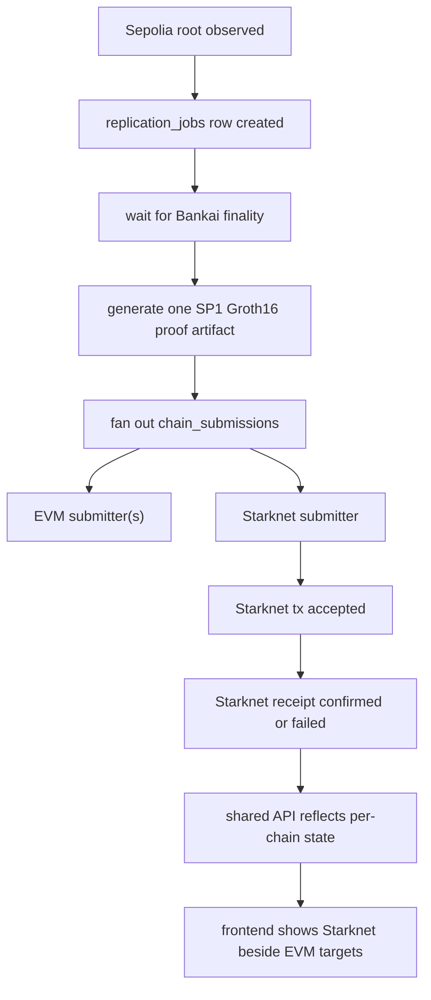

# feat: Add Starknet Sepolia as the first non-EVM replication target

## Overview

Extend `world-id-root-replicator` so every finalized World ID root can fan out
to Starknet Sepolia in addition to the existing EVM testnets.

This is the first non-EVM destination for the project, so the work is bigger
than "add one more chain." We need to keep the existing single-job,
single-proof, multi-destination shape from the original brainstorm while
removing the last EVM-only assumptions from contract deployment, backend
submission, and frontend presentation.

This plan uses the existing World ID root replicator brainstorm as its origin
document because the product, trust model, and job pipeline are unchanged
overall, even though this child plan intentionally extends a scope boundary the
brainstorm deferred. The brainstorm explicitly chose reliability, one Rust
application, one SQLite database, one proof artifact per source block, and
destination chains as configuration rather than separate products (see
brainstorm: `docs/brainstorms/2026-03-17-world-id-root-replicator-brainstorm.md`).

Assumption carried into this plan:

- The user’s note about an "equivalent solana contract" is interpreted as "an
  equivalent non-EVM contract for Starknet" because the requested chain is
  Starknet Sepolia.

## Problem statement

The current implementation is already multichain within the EVM family, but it
is not chain-family-agnostic yet.

Today the codebase still assumes:

- destination contracts are EVM addresses in config
- destination writes happen through `alloy` and an EVM ABI call only
- the destination contract interface is `submitRoot(bytes,bytes)`
- deployment automation only exists for Foundry-based EVM contracts
- frontend metadata only knows Etherscan-style explorers

Concrete local cut points:

- `world-id-root-replicator/backend/src/config.rs:20` stores destination
  contract addresses as `alloy_primitives::Address`, which is EVM-specific.
- `world-id-root-replicator/backend/src/chains/mod.rs:12` hard-codes the EVM
  `submitRoot(bytes proofBytes, bytes publicValues)` interface.
- `world-id-root-replicator/backend/src/chains/mod.rs:32` only implements
  `EvmSubmitter`.
- `world-id-root-replicator/backend/src/jobs/types.rs:33` only enumerates the
  three EVM destinations.
- `world-id-root-replicator/backend/src/api/mod.rs:24` and
  `world-id-root-replicator/frontend/lib/api.ts:12` expose a generic enough
  read model already, but the naming and explorer metadata are still EVM-led.
- `world-id-root-replicator/frontend/lib/chain-metadata.ts:1` only maps Base,
  OP, and Arbitrum explorer URLs.
- `world-id-root-replicator/contracts/script/deploy_registry.sh:1` only
  handles EVM deployment and verification.

Without a focused plan, we risk bolting Starknet on as a second pipeline
instead of preserving the existing single-proof fan-out model.

## Research findings

### Brainstorm and prior-plan decisions carried forward

- Keep one Rust backend process and one SQLite database. Do not split Starknet
  into a separate worker or relayer service (see brainstorm:
  `docs/brainstorms/2026-03-17-world-id-root-replicator-brainstorm.md`).
- Keep one proof per observed source block, then fan that artifact out to all
  configured destinations (see
  `docs/plans/2026-03-17-004-feat-world-id-root-replicator-phase-3-multichain-fanout-plan.md`).
- Preserve the existing read-only API and frontend projection model rather than
  inventing a Starknet-specific UI surface (see
  `docs/plans/2026-03-17-005-feat-world-id-root-replicator-phase-4-read-only-api-frontend-plan.md`).

### Local code findings

- The current proof artifact flow is close to sufficient for Starknet fan-out.
  `world-id-root-replicator/backend/src/proving/sp1.rs` already saves the SP1
  Groth16 proof artifact and exposes ABI-encoded public values, while
  `world-id-root-replicator/backend/src/bin/print_program_vkey.rs` already
  exposes the program vkey we will also need on Starknet.
- The read model is already generic enough to show one more destination.
  `registry_address`, `tx_hash`, `submission_state`, and `chain_name` are all
  plain strings in the API/database projection layer.
- The database does not need a new table for Starknet. The existing
  `chain_submissions` table already stores per-chain fan-out state with a text
  address field and a `UNIQUE(replication_job_id, chain_name)` constraint.

### External research

The user-provided `settlement-demo` repository is the strongest practical guide
for this exact stack combination because it already shows how this team wired
Starknet deployment and transactions around an SP1 proof.

Key takeaways from `settlement-demo`:

- The Cairo contract verifies SP1 Groth16 proofs through Garaga and pins the
  program verification key in contract storage, rather than mirroring the EVM
  ABI exactly. See:
  `/tmp/settlement-demo/contracts/starknet/src/lib.cairo:53`,
  `/tmp/settlement-demo/contracts/starknet/src/lib.cairo:113`.
- The deployment flow is `scarb build` -> `sncast declare` -> `sncast deploy`,
  with constructor calldata for the pinned program vk. See:
  `/tmp/settlement-demo/contracts/starknet/deploy.sh:14`,
  `/tmp/settlement-demo/contracts/starknet/deploy.sh:17`,
  `/tmp/settlement-demo/contracts/starknet/deploy.sh:41`.
- The Starknet Rust client can submit transactions directly with the
  `starknet` crate using a raw private key plus account address, which fits the
  credentials the user supplied for this project. See:
  `/tmp/settlement-demo/script/src/client/starknet_client.rs:28`.
- Garaga calldata generation can be done on the fly from three values:
  `proof.bytes()`, `proof.public_values`, and the SP1 program vkey. See:
  `/tmp/settlement-demo/script/src/client/starknet_client.rs:53`,
  `/tmp/settlement-demo/script/src/bin/main.rs:158`.

Relevant official documentation confirmed during planning:

- Starknet Foundry supports importing an account, declaring classes, deploying
  contracts, and invoking transactions with `sncast`.
- Starknet explorer coverage is available for Sepolia on both Voyager and
  Starkscan; frontend work should standardize on one explorer family rather
  than mixing them.

There is still no `docs/solutions/` directory in this repository, so there are
no prior institutional learnings to inherit.

## Research decision

External research was necessary for this plan.

Why:

- this is the first non-EVM destination and therefore a new chain family
- deployment tooling changes from Foundry/Forge to Scarb + Starknet Foundry
- proof submission shape changes from EVM ABI bytes to Starknet Garaga calldata
- the user explicitly pointed to an external implementation to reuse

## Proposed solution

Keep the overall pipeline exactly the same and swap in a Starknet-specific
submitter at the last hop.

That means:

1. watch Sepolia for new World ID roots exactly as today
2. wait for Bankai finality exactly as today
3. generate one SP1 Groth16 proof artifact exactly as today
4. create one more `chain_submissions` row for `starknet-sepolia`
5. route that row through a `StarknetSubmitter`
6. show that target in the existing API and frontend next to the EVM targets

This keeps the architecture aligned with the original brainstorm instead of
forking the product into an "EVM mode" and a "Starknet mode."

### Intentional design choices

#### Keep proof generation unchanged if the current artifact can feed Garaga

The first implementation spike in this plan is to prove that
`SP1ProofWithPublicValues::bytes()`, the saved public values, and the program
vkey can generate Starknet calldata via Garaga without changing the proof
pipeline.

If that works, do not redesign proof persistence.

If it does not work, add the smallest possible helper in
`world-id-root-replicator/backend/src/proving/sp1.rs` to export the exact trio
Starknet needs:

- `proof`
- `publicValues`
- `vkey`

#### Keep the database model unchanged

Do not create Starknet-specific workflow tables.

The existing `chain_submissions` table already models what we need:

- configured destination name
- numeric chain id for display/filtering
- contract address string
- tx hash
- independent retry/error state

#### Keep the API shape stable

The frontend should not need a new endpoint just because one target is
Starknet. The existing `/api/chains`, `/api/roots/latest`, and `/api/roots`
responses are already close to sufficient.

#### Aim for semantic equivalence, not ABI equivalence

The Starknet contract should do the same job as the Solidity registry:

- verify the proof against the intended SP1 program
- decode the public values
- reject stale or conflicting updates
- store `root` by `source_block_number`
- update `latest_root` and `latest_source_block`
- emit a replication event

But the call shape does not need to match `submitRoot(bytes,bytes)` exactly.
On Starknet, the cleanest equivalent is a Cairo entrypoint that accepts the
Garaga proof calldata and derives the public inputs from verification output.

## SpecFlow analysis

### Core flow



### Required state permutations

| Scenario | Required behavior |
| --- | --- |
| Root is still waiting for Bankai finality | Starknet target shows `blocked`, same as EVM targets |
| Proof is ready but Starknet send has not started | Starknet target shows `queued` |
| Starknet send is broadcast but receipt not final | Starknet target shows `submitting` with tx hash |
| Starknet tx succeeds while one EVM chain fails | Preserve mixed outcomes; do not collapse into all-success or all-failure |
| Starknet proof conversion fails before send | Mark only the Starknet submission failed, keep other chains independent |
| Starknet contract rejects stale/conflicting root | Surface the revert reason on that chain submission row and keep the job aggregate logic unchanged |

### Edge cases to plan for

- Starknet account import exists locally already.
- Contract class is already declared on Sepolia.
- Garaga calldata generation fails because the SP1 artifact format is not what
  `Groth16Proof::from_sp1(...)` expects.
- The account signs against the wrong chain id or wrong execution encoding.
- Starknet receipt status stays pending longer than EVM receipts.
- The frontend shortens/display-links a Starknet contract address correctly but
  still calls it "Registry" in a chain-neutral way.

## Technical approach

### Architecture changes

Add one new destination family while preserving the current backend seams:

- keep `SubmissionClient`
- add a Starknet implementation next to the EVM one
- make destination config parse addresses as chain-family-specific strings
- keep all job orchestration in `backend/src/jobs/runner.rs`
- keep read models and fan-out state generic

### Contract work

Create a new Starknet contract package:

```text
world-id-root-replicator/contracts/starknet/
├── Scarb.toml
├── snfoundry.toml
├── README.md
├── deploy.sh
├── src/
│   └── lib.cairo
└── tests/
    ├── test_root_registry.cairo
    └── test_root_registry_fork.cairo
```

Recommended Cairo contract surface:

- constructor:
  `constructor(initial_roots: Span<u256>, program_vk: u256)` or the smaller
  `constructor(program_vk: u256)` if we do not need seeded state
- write:
  `submit_root(proof: Array<felt252>)`
- read:
  `get_root(source_block_number: u64) -> u256`
- read:
  `get_latest_root() -> u256`
- read:
  `get_latest_source_block() -> u64`

Recommended storage:

- `roots_by_source_block: Map<u64, u256>`
- `latest_root: u256`
- `latest_source_block: u64`
- `program_vk: u256`

Recommended semantics:

- verify the proof via Garaga’s Starknet verifier class hash
- assert the verified program vk matches the configured one
- decode the first two public inputs into `(source_block_number, root)`
- reject `source_block_number <= latest_source_block`
- reject conflicting replays for the same source block
- store root and emit `RootReplicated`

Recommended test coverage in
`world-id-root-replicator/contracts/starknet/tests/test_root_registry.cairo`:

- accepts one valid proof fixture
- rejects stale source block
- rejects conflicting root for same source block
- rejects wrong program vk
- exposes latest root and per-block root reads

Recommended fork coverage in
`world-id-root-replicator/contracts/starknet/tests/test_root_registry_fork.cairo`:

- verifies a real Sepolia-ready proof fixture against the live verifier class
- exercises deploy-time constructor values on Sepolia RPC

### Deployment work

Add Starknet deployment automation that mirrors the current EVM helper in
purpose, but uses Scarb + Starknet Foundry instead of Forge.

Files:

- `world-id-root-replicator/contracts/starknet/deploy.sh`
- `world-id-root-replicator/contracts/starknet/snfoundry.toml`
- `world-id-root-replicator/contracts/starknet/README.md`
- `world-id-root-replicator/contracts/README.md`

The deployment script should:

1. load `../.env`
2. require `STARKNET_SEPOLIA_RPC`, `STARKNET_PRIVATE_KEY`,
   `STARKNET_ACCOUNT_ADDRESS`
3. import the deployed account into a workspace-local `sncast` accounts file if
   it is not already present
4. build with `scarb build`
5. declare the class with `sncast declare`
6. deploy the contract with the program vk constructor arg
7. print `STARKNET_SEPOLIA_REGISTRY_ADDRESS=...` for `.env`

Recommended env surface:

- `STARKNET_SEPOLIA_RPC`
- `STARKNET_PRIVATE_KEY`
- `STARKNET_ACCOUNT_ADDRESS`
- `STARKNET_SEPOLIA_REGISTRY_ADDRESS`
- `STARKNET_SP1_PROGRAM_VK` or reuse `PROGRAM_VKEY` if we want one canonical vk

Secrets rule:

- use the user-provided private key and account only from local env
- do not write secret values into tracked files, READMEs, or plan examples

### Backend work

#### Config and destination model

Refactor config so destination addresses are no longer forced through
`alloy_primitives::Address`.

Target files:

- `world-id-root-replicator/backend/src/config.rs`
- `world-id-root-replicator/backend/src/jobs/types.rs`

Recommended minimal direction:

- extend `DestinationChain` with `StarknetSepolia`
- keep `chain_name` string values stable and add `starknet-sepolia`
- keep `chain_id` as `u64` for read-model compatibility
- represent destination contract addresses in config as `String`, then parse
  them inside the submitter that owns that chain family

For the Starknet numeric `chain_id`, use the same representation already used
in `settlement-demo` (`393402133025997798`) as the display/store value, but
treat `provider.chain_id()` as the runtime signing source of truth during
implementation. This numeric choice is based on the example repo and should be
validated against a live provider during coding.

#### New Starknet submitter

Add:

- `world-id-root-replicator/backend/src/chains/starknet.rs`

Keep:

- `world-id-root-replicator/backend/src/chains/mod.rs`

Responsibilities of `StarknetSubmitter`:

- create a Starknet account from `STARKNET_PRIVATE_KEY` and
  `STARKNET_ACCOUNT_ADDRESS`
- connect to `STARKNET_SEPOLIA_RPC`
- load the saved SP1 proof artifact
- derive Garaga calldata from `proof.bytes()`, `public_values`, and the program
  vkey
- invoke `submit_root`
- poll the Starknet receipt and translate it into
  `SubmissionCheck::{Pending, Confirmed, Failed}`

Dependencies likely needed in `world-id-root-replicator/backend/Cargo.toml`:

- `starknet`
- `garaga_rs`

#### Runner integration

Update:

- `world-id-root-replicator/backend/src/jobs/runner.rs`

Required changes:

- instantiate `StarknetSubmitter` for `DestinationChain::StarknetSepolia`
- keep one `submission_clients` map keyed by chain name
- do not branch the top-level job state machine by chain family
- preserve the existing aggregate rules from Phase 3

#### Proof helper work

Update only if needed:

- `world-id-root-replicator/backend/src/proving/sp1.rs`
- `world-id-root-replicator/backend/src/bin/print_program_vkey.rs`

Preferred outcome:

- reuse the current proof artifact format unchanged

Fallback if needed:

- add a helper that returns `{ proof, public_values, vkey }` in exactly the
  shape Garaga expects

### Frontend and API work

The current API shape should mostly survive unchanged. The work is mainly
metadata and chain-family-neutral copy.

Target files:

- `world-id-root-replicator/backend/src/api/mod.rs`
- `world-id-root-replicator/backend/src/api/read_models.rs`
- `world-id-root-replicator/frontend/lib/api.ts`
- `world-id-root-replicator/frontend/lib/chain-metadata.ts`
- `world-id-root-replicator/frontend/components/replication-target-card.tsx`
- `world-id-root-replicator/frontend/components/replication-topology.tsx`

Required UI changes:

- add `starknet-sepolia` metadata
- add Starknet explorer links for txs and contract addresses
- ensure labels say `Starknet` cleanly
- keep card/body copy chain-neutral
- confirm topology ordering still looks intentional with four destinations

Recommended explorer choice:

- standardize on one Starknet explorer family for both txs and contracts,
  ideally Voyager for both or Starkscan for both
- do not mix Voyager tx URLs with Starkscan contract URLs in the frontend

### Documentation work

Update:

- `world-id-root-replicator/README.md`
- `world-id-root-replicator/contracts/README.md`
- new `world-id-root-replicator/contracts/starknet/README.md`

Document:

- required Starknet toolchain
- local env names
- deploy command
- how backend submission credentials are loaded
- how to validate a Starknet replication tx on the chosen explorer

## Implementation phases

### Phase 0: Proof-calldata spike

Goal:

- prove that the current SP1 artifact can be transformed into Starknet Garaga
  calldata without redesigning the proof pipeline

Deliverables:

- small Rust-only spike or test helper in
  `world-id-root-replicator/backend/src/proving/sp1.rs`
- confirmation of the final constructor vk format and runtime submit calldata

Exit criteria:

- we can derive Starknet calldata from the existing proof output, or we know
  the smallest artifact export change required

### Phase 1: Cairo registry and tests

Goal:

- land the Starknet root-registry contract with equivalent semantics to the
  Solidity contract

Deliverables:

- `contracts/starknet/src/lib.cairo`
- unit tests and one fork/integration path
- proof fixture generation if needed for tests

Exit criteria:

- one valid proof updates `latest_root` and `latest_source_block`
- stale/conflicting/wrong-vk cases fail

### Phase 2: Deployment automation

Goal:

- make Starknet Sepolia deployment repeatable from this repo

Deliverables:

- `contracts/starknet/deploy.sh`
- `contracts/starknet/snfoundry.toml`
- README setup instructions

Exit criteria:

- the provided Sepolia account can declare and deploy the contract locally
- the script prints the env line for backend/frontend use

### Phase 3: Backend fan-out integration

Goal:

- let the existing runner submit completed proof artifacts to Starknet Sepolia

Deliverables:

- config/destination expansion
- `StarknetSubmitter`
- runner wiring
- backend tests covering mixed EVM + Starknet outcomes

Exit criteria:

- a completed proof creates and advances a `starknet-sepolia` submission row
- EVM chains keep working unchanged
- mixed destination outcomes remain isolated

### Phase 4: Frontend integration and operator polish

Goal:

- make Starknet visible as a first-class destination in the read-only UI

Deliverables:

- updated chain metadata and explorer links
- topology/card rendering that looks intentional with four targets
- any copy updates needed to remove EVM-only language

Exit criteria:

- the landing page and dashboard show Starknet status, tx links, and contract
  links cleanly

## System-wide impact

### Interaction graph

`world_id::watcher` still creates the root/job rows. `jobs::runner` still owns
the full lifecycle. After proof readiness, the same runner now dispatches to
either an EVM submitter or a Starknet submitter based on `chain_name`.
`db::job_submissions(...)` remains the source of truth for per-target state,
and `api::read_models` plus the Next.js frontend continue to project that
state outward.

### Error and failure propagation

- Bankai finality or SP1 proof failures remain shared job-level blockers.
- Starknet calldata generation failure should fail only the
  `starknet-sepolia` submission unless it proves the artifact is structurally
  invalid for every destination.
- Starknet RPC/send/receipt failures should map into the existing
  per-submission retry/failure path.
- A Starknet contract revert should surface in `chain_submissions.error_message`
  and should not roll back confirmed EVM submissions.

### State lifecycle risks

- If a Starknet tx hash is returned but no receipt is available yet, the row
  must stay `submitting`; do not blindly resubmit and risk duplicate writes.
- If Starknet confirms first and an EVM target later fails, the job aggregate
  logic must preserve the confirmed Starknet result.
- If the contract address or vk is misconfigured, the pipeline will appear
  healthy until the first send. That makes early deploy-validation mandatory.

### API surface parity

No new API routes should be required.

The existing routes should continue to serve:

- `GET /api/status`
- `GET /api/roots/latest`
- `GET /api/roots`
- `GET /api/chains`
- `GET /api/jobs/:id`

### Integration test scenarios

1. One proof confirms on Base/OP/Arbitrum and Starknet in sequence, then the
   dashboard shows four confirmed targets.
2. One proof confirms on EVM chains but Starknet calldata generation fails, and
   the latest job snapshot shows mixed results without losing confirmed txs.
3. Starknet tx is broadcast and remains pending across multiple runner loops,
   and the row stays `submitting` instead of spawning duplicates.
4. Starknet contract is deployed with the wrong program vk, and only the
   Starknet submission fails with a clear error path.

## Acceptance criteria

### Functional requirements

- [x] `DestinationChain` includes `starknet-sepolia`, and the backend loads it
      from config without creating a second pipeline.
- [x] A Starknet Cairo contract exists under
      `world-id-root-replicator/contracts/starknet/` and functionally mirrors
      the Solidity root registry.
- [x] The Starknet contract verifies SP1 Groth16 proofs via Garaga and pins the
      intended program vk.
- [ ] A deployment script can declare and deploy the Starknet contract on
      Starknet Sepolia using the user-provided local credentials.
- [x] The backend can submit a completed proof artifact to Starknet Sepolia and
      store the tx hash/receipt result in `chain_submissions`.
- [x] The existing API surfaces include Starknet as another destination chain.
- [x] The frontend renders Starknet as a first-class target with correct links
      and labels.

### Non-functional requirements

- [x] EVM replication continues to work without behavioral regression.
- [x] The Starknet addition stays minimal and modular; no new service split, no
      extra queue, no duplicate workflow tables.
- [x] Secret material remains local-only and out of tracked files.

### Quality gates

- [x] Rust tests cover config parsing, submitter routing, and mixed chain
      outcomes.
- [ ] Cairo tests cover success, stale root, conflicting root, and wrong-vk
      cases.
- [ ] At least one manual or fork-based Sepolia validation proves the full
      deploy -> submit -> observe loop.
- [x] README and deploy docs are updated.

## Implementation notes

### 2026-03-17 progress update

Implemented in this worktree:

- backend config, routing, proof-calldata generation, and submission support
  for `starknet-sepolia`
- chain-id read-model cutover from numeric values to strings so Starknet's
  canonical Sepolia ID can flow through SQLite and the frontend safely
- a new Cairo contract package under `contracts/starknet/`
- Starknet deployment helper and docs
- frontend metadata and explorer links for Starknet

Validated locally:

- `cargo test -p world-id-root-replicator-backend`
- `npm run build` in `world-id-root-replicator/frontend`
- `bash -n world-id-root-replicator/contracts/starknet/deploy.sh`

Not yet validated in this environment:

- `snforge test`
- `scarb build`
- live `sncast` declare/deploy/invoke against Starknet Sepolia

Reason:

- this workspace does not currently have `scarb`, `snforge`, or `sncast`
  installed

## Success metrics

- One newly observed Sepolia World ID root can be replicated to Starknet
  Sepolia without manual calldata crafting.
- The backend can show one additional destination chain without API redesign.
- The frontend can display four targets cleanly without layout breakage.
- Operators can deploy or redeploy the Starknet contract from this repo with a
  documented command.

## Dependencies and prerequisites

- Starknet Foundry (`sncast`, `snforge`)
- Scarb
- `starknet` Rust crate
- `garaga_rs`
- one chosen Starknet explorer standard for UI links
- a deployed Starknet Sepolia account funded with test ETH

The user has already supplied:

- a Starknet Sepolia private key
- a Starknet account address
- a Starknet Sepolia RPC endpoint

Those values should be consumed from local env only during implementation.

## Risks and mitigations

- Risk: Garaga preprocessing does not accept the current artifact directly.
  Mitigation: make Phase 0 a hard gate before refactoring the runner.
- Risk: `sncast` account handling is awkward with raw env credentials.
  Mitigation: make the deploy script import the account automatically into a
  workspace-local accounts file before declare/deploy.
- Risk: EVM-oriented naming like `registry_address` causes confusion.
  Mitigation: keep the field name for minimal churn, but update docs and UI copy
  to describe it generically as the destination contract address or registry.
- Risk: UI explorer links become inconsistent across chain families.
  Mitigation: centralize Starknet explorer metadata in one place and use a
  single explorer family.

## Documentation plan

- Add a Starknet contract README with toolchain, build, test, and deploy steps.
- Update the top-level project README with the new destination chain and env.
- Update the contracts README so EVM and Starknet deployment stories sit side
  by side.
- Document the chosen explorer URLs used by the frontend.

## Sources and references

### Origin

- Brainstorm document:
  `docs/brainstorms/2026-03-17-world-id-root-replicator-brainstorm.md`
  Key decisions carried forward: one Rust backend, one SQLite source of truth,
  one proof per source block, destinations as configuration.

### Internal references

- `world-id-root-replicator/backend/src/config.rs:20`
- `world-id-root-replicator/backend/src/chains/mod.rs:12`
- `world-id-root-replicator/backend/src/jobs/types.rs:33`
- `world-id-root-replicator/backend/src/proving/sp1.rs:10`
- `world-id-root-replicator/backend/src/bin/print_program_vkey.rs:1`
- `world-id-root-replicator/backend/src/api/mod.rs:24`
- `world-id-root-replicator/frontend/lib/api.ts:12`
- `world-id-root-replicator/frontend/lib/chain-metadata.ts:1`
- `docs/plans/2026-03-17-004-feat-world-id-root-replicator-phase-3-multichain-fanout-plan.md`
- `docs/plans/2026-03-17-005-feat-world-id-root-replicator-phase-4-read-only-api-frontend-plan.md`

### External references

- `settlement-demo` Starknet contract:
  `/tmp/settlement-demo/contracts/starknet/src/lib.cairo:42`
- `settlement-demo` Starknet deployment script:
  `/tmp/settlement-demo/contracts/starknet/deploy.sh:14`
- `settlement-demo` Starknet Rust client:
  `/tmp/settlement-demo/script/src/client/starknet_client.rs:28`
- `settlement-demo` proof export shape:
  `/tmp/settlement-demo/script/src/bin/main.rs:146`
- Starknet Foundry `sncast account import` docs:
  https://foundry-rs.github.io/starknet-foundry/appendix/sncast/account/import.html
- Starknet Foundry `sncast invoke` docs:
  https://foundry-rs.github.io/starknet-foundry/appendix/sncast/invoke.html
- Starknet Foundry `sncast declare` docs:
  https://foundry-rs.github.io/starknet-foundry/appendix/sncast/declare.html
- Starknet Foundry `sncast deploy` docs:
  https://foundry-rs.github.io/starknet-foundry/appendix/sncast/deploy.html
